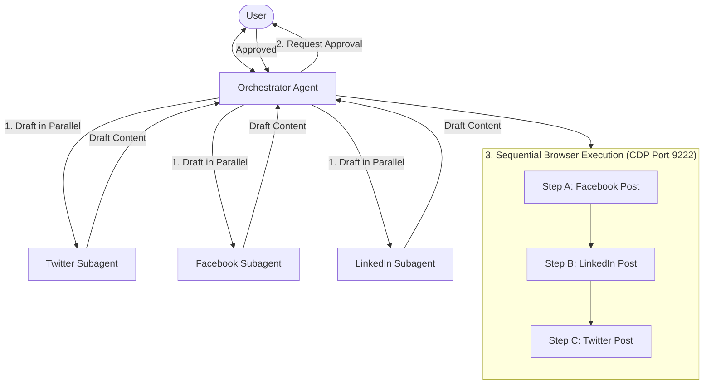

# Social Platform Orchestrator

Use this skill to coordinate multi-platform social media operations across **Twitter/X**, **Facebook**, and **LinkedIn**, and conduct target audience research on **Reddit**:
- `tools/social_agent/`: Shared browser startup, CDP connectivity diagnostics, configuration, safe connection/disconnection, and tool-owned tab management. It does **not** authenticate accounts, navigate social platforms, or publish content.
- `tools/twitter_agent/`: Terminal-operated X DOM CLI with reply workflows and standalone approved image publishing.
- `tools/facebook_agent/`: Direct DOM publishing of approved text and an optional single image to personal Facebook profiles.
- `tools/linkedin_agent/`: Direct approved-input doctor and publishing CLI for personal LinkedIn profiles with repeatable ordered images.
- `tools/reddit-research-mcp/`: Semantic vector discovery across 20,000+ indexed subreddits to identify niche communities relevant to any topic, audience, or pain point.
- `tools/reddit_agent/research.py`: Zero-credential standalone research tool to paginate and extract chronological posts and discussions from any subreddit with timeframe filtering (`--months`) into local JSON.

> [!IMPORTANT]
> **MANDATORY RULE: STRICTLY USE EXISTING REPOSITORY TOOLS ONLY**
> You must strictly use the existing repository CLI and research tools (`uv run python -m tools.social_agent`, `uv run python -m tools.facebook_agent`, `uv run python -m tools.linkedin_agent`, `uv run python -m tools.twitter_agent`, `uv run python -m tools.twitter_agent.publish`, `tools/reddit-research-mcp`, and `python3 tools/reddit_agent/research.py`).
> - **DO NOT wander around writing or running ad-hoc Python snippets, one-liners (`python -c ...`), custom scripts, or ad-hoc automation code.**
> - All browser management, diagnostics, configuration/environment inspection, publishing, and Reddit research must be executed directly through the established tool interfaces.

### Configuration
Run all commands from the repository root. Read [`tools/social_agent/README.md`](../../../tools/social_agent/README.md) for shared browser command reference and [`references/platform-matrix.md`](references/platform-matrix.md) for publishing constraints.

Configuration resolves in this order: **explicit CLI arguments → environment variables → defaults**. The shared package loads `tools/.env` when `python-dotenv` is available, without overriding existing environment values. [`tools/.env.example`](../../../tools/.env.example) contains a minimal template; do not overwrite an existing `.env`.

| Setting | Environment variable(s) | Default |
| :--- | :--- | :--- |
| CDP endpoint for diagnostics/connection | `CDP_ENDPOINT` | `http://127.0.0.1:9222` (derived from host/port if overridden) |
| CDP host | `CDP_HOST` | `127.0.0.1` |
| Startup port | `CDP_PORT`, then `PORT` | `9222` |
| Chrome user data directory | `CHROME_USER_DATA_DIR`, then `USER_DATA_DIR` | `$HOME/chrome-twitter-profile` |
| Diagnostic timeout (milliseconds) | `DEFAULT_DOCTOR_TIMEOUT_MS` | `30000` |
| Startup readiness timeout (seconds) | `CDP_READINESS_TIMEOUT_SECONDS` | `15.0` |
| Browser executable | `CHROME_BIN` | Auto-detected Chromium/Chrome-compatible binary |
| X publishing account | `TWITTER_ACCOUNT` | Read the configured handle; do not invent one |

Keep the launch host/port and connection endpoint consistent. `start-browser` probes and launches using the configured **host and port**, not the URL in `CDP_ENDPOINT`; changing only that URL does not change the launch port. Platform CLIs may have their own endpoint defaults: check their help and pass the same endpoint explicitly when using a non-default browser.

---

## 1. Shared Browser Control and Serialization

All three platform tools share the standalone `tools/social_agent` browser foundation and connect to the **same dedicated Chrome browser** via Chrome DevTools Protocol (CDP):
- **Default CDP Port**: `http://127.0.0.1:9222`
- **Shared Chrome Profile**: `$HOME/chrome-twitter-profile`
- **Browser Launcher**: `uv run python -m tools.social_agent start-browser`
- **Browser Diagnostics**: `uv run python -m tools.social_agent doctor`

### Browser control workflow

1. Check the shared browser without navigating or modifying open tabs:
   ```bash
   uv run python -m tools.social_agent doctor
   ```
2. If the browser is unavailable, start or reuse the dedicated browser:
   ```bash
   uv run python -m tools.social_agent start-browser
   ```
   Require exit code `0` and JSON `ok: true`. `data.action` is `started` or `reused`. An existing responsive browser is reused, not restarted; reuse does not verify its actual profile or account identity.
3. Run the shared `doctor` again after startup to verify CDP connectivity and an active browser context.
4. Run the relevant **platform** `doctor` commands sequentially to check authentication and platform readiness. Shared `doctor` success does **not** mean an account is logged in.

For a custom local browser, keep startup and diagnostics aligned:
```bash
uv run python -m tools.social_agent start-browser \
  --port 9333 \
  --data-dir "$HOME/chrome-social-profile" \
  --timeout 20 \
  --chrome-bin "/Applications/Google Chrome.app/Contents/MacOS/Google Chrome"
uv run python -m tools.social_agent doctor \
  --endpoint http://127.0.0.1:9333 \
  --timeout-ms 30000
```

`doctor` accepts `--cdp` as an alias for `--endpoint`. Startup uses `--timeout` in **seconds**; diagnostics use `--timeout-ms` in **milliseconds**. Keep debugging bound to loopback; do not expose CDP to the network.

### Browser and tab safety

- Use `uv run python -m tools.social_agent start-browser` for shared browser startup.
- Do not kill or restart a responsive browser, delete its profile, close user tabs, or close the browser/context to clean up automation.
- Shared `CDPBrowser` detaches by stopping the Playwright client, without calling `browser.close()` or `context.close()`.
- Temporary pages created by the shared connection are tracked and closed on context-manager exit. A page marked with `preserve_page()` stays open for human inspection; unmanaged/user tabs are never closed.
- Ask the user to handle login, CAPTCHA, checkpoints, and account mismatches manually. Do not attempt to bypass them.

> [!CAUTION]
> **STRICT CDP MUTUAL EXCLUSION (SERIALIZATION)**
> Never run browser automation commands concurrently across multiple platforms against the same Chrome instance. Running simultaneous Playwright/CDP operations against the shared profile causes tab collisions, focus conflicts, and state corruption.
>
> - **Drafting & Content Adaptation**: Can run in **parallel** across subagents.
> - **Live Browser Execution (`start-browser`, shared/platform `doctor`, `post`, `publish`, `search`, `thread`, `reply submit`)**: Must be executed **strictly sequentially** against the same browser, including across subagents.
> - Serialization is an orchestrator scheduling rule, not a global lock provided by `tools/social_agent`. Await each browser command or execution subagent before starting the next; do not use background or parallel browser calls.

---

## 2. Multi-Agent Topology & Roles

For a multi-platform campaign, drafting may be delegated to platform specialists using the harness's available subagent tool. A single-platform task can be handled directly. The parent owns shared browser control, approval, and execution order:



### Roles:
1. **Orchestrator Agent (Parent)**:
   - Serves as the primary contact with the user.
   - Accepts core topic, message, or campaign outline.
   - Dispatches platform subagents to draft tailored content.
   - Presents unified cross-platform review to the user for explicit approval.
   - Runs shared startup/diagnostics and schedules sequential platform browser calls.
   - Collects JSON execution results and reports overall status.

2. **Twitter Subagent (`twitter-platform-agent`)**:
   - Specializes in X mechanics: short hooks, 280-char boundaries, thread structures, reply discovery, and standalone image posts.
   - CLI Target: `tools/twitter_agent/` and `tools/twitter_agent/publish.py`.
   - Respects rate quotas (6/hour, 20/day, 120s spacing, 3 per 30m burst).

3. **Facebook Subagent (`facebook-platform-agent`)**:
   - Specializes in personal Facebook updates: conversational tone, storytelling, link formatting, single photo attachments.
   - CLI Target: `tools/facebook_agent/`.
   - Validates text (required) and optional single image (PNG/JPEG/GIF/WebP).

4. **LinkedIn Subagent (`linkedin-platform-agent`)**:
   - Specializes in professional LinkedIn posts: industry insight, framework breakdowns, ordered carousel/multi-image posts.
   - CLI Target: `tools/linkedin_agent/`.
   - **Crucial Rule**: LinkedIn tool **requires at least one image** (1–20 PNG/JPEG files, <= 10 MiB each). Text-only posts are unsupported in this tool.

---

## 3. Platform Capabilities & Validation Matrix

Always validate content against platform constraints **before** invoking browser tools:

| Feature / Rule | Twitter / X (`tools/twitter_agent`) | Facebook (`tools/facebook_agent`) | LinkedIn (`tools/linkedin_agent`) |
| :--- | :--- | :--- | :--- |
| **Account Type** | Specified account (`--account`) | Personal profile only (`/me`) | Personal profile only |
| **Text Requirement** | Required. Under 280 chars (unless long-form subscriber). | Non-empty text required. Multiline supported. | Required, non-blank, max 3,000 characters. |
| **Media Requirement** | Standalone publish requires exactly 1 image. | Optional: 0 or 1 image (PNG, JPEG, GIF, WebP). | **Mandatory: 1 to 20 images** (PNG or JPEG only, max 10MB each). |
| **Media Constraints** | Photo only. Video unsupported in CLI. | Single image only. Multi-image/video unsupported. | **Text-only unsupported**. GIF/WebP/video unsupported. |
| **Audience Control** | Public by default. | Inherited from Facebook composer setting. | Inherited from LinkedIn composer setting. |
| **Human Approval** | Explicit `--approved` flag required for `publish`. | Invoking `post` triggers immediate DOM publication. | Invoking `post` triggers immediate DOM publication. |
| **Quotas & Pacing** | 6/hr, 20/24hr, 120s between submissions, 3/30min. | None enforced in tool; manual pacing recommended. | None enforced in tool; manual pacing recommended. |

---

## 4. Standard Operating Workflows

### Workflow 1: Cross-Platform Campaign Broadcast

Use when publishing a single announcement, article, or insight across all three platforms.

#### Step 1: Pre-Flight Browser Health Check
Follow the browser control workflow in Section 1 first. Once shared `doctor` succeeds, check login and platform readiness for the requested platforms only. Run sequentially:
```bash
# Verify Chrome CDP is alive and each platform is logged in
uv run python -m tools.facebook_agent doctor
uv run python -m tools.linkedin_agent doctor
uv run python -m tools.twitter_agent doctor
```

> [!IMPORTANT]
> **DOCTOR RETRY POLICY (MAX 3 TOTAL ATTEMPTS)**
> Retry only transient diagnostic failures, with a 2–3 second delay between attempts. Do not retry invalid arguments, missing browser binaries, login challenges, or other failures requiring manual action. Stop and report the error after three total attempts. Do not repeatedly launch browsers after a startup readiness timeout; inspect the existing process and configuration with the user first.

#### Step 2: Content Adaptation (Parallel Drafting)
Dispatch subagents to produce platform-adapted drafts from the source content:
- **Facebook Draft**: Casual, narrative-driven, full context, optional 1 image.
- **LinkedIn Draft**: Professional take, structural takeaways, 1–20 required images (e.g. infographic, slide cards, or cover image).
- **Twitter Draft**: Punchy hook, under 280 characters, accompanied by 1 image.

#### Step 3: Human-in-the-Loop Approval Gate (MANDATORY)
Present all three adapted drafts and image paths clearly to the user:
```markdown
### Cross-Platform Publishing Proposal

#### 1. Facebook Personal Profile
- **Text**: <exact text>
- **Image**: <path or None>

#### 2. LinkedIn Personal Profile
- **Text**: <exact text>
- **Image(s)**: <paths, 1-20 PNG/JPEG>

#### 3. Twitter / X (@Handle)
- **Text**: <exact text>
- **Image**: <single image path>
```
> [!IMPORTANT]
> **DO NOT CALL POST OR PUBLISH COMMANDS WITHOUT EXPLICIT USER APPROVAL.**
> The tools do not have an interactive confirmation prompt. Invoking the CLI publishes immediately.

#### Step 4: Sequential Publishing (Enforce Concurrency Lock)
Once the user explicitly confirms, execute the commands **sequentially**:

1. **Facebook**:
   ```bash
   uv run python -m tools.facebook_agent post \
     --text "Approved Facebook post text" \
     --image "/absolute/path/to/image.png"
   ```
   *Verify exit code 0 and JSON `{"ok": true}` before proceeding.*

2. **LinkedIn**:
   ```bash
   uv run python -m tools.linkedin_agent post \
     --text "Approved LinkedIn post text" \
     --image "/absolute/path/to/image.png"
   ```
   *Verify exit code 0 and JSON `{"ok": true}` before proceeding.*

3. **Twitter / X**:
   ```bash
   uv run python -m tools.twitter_agent.publish \
     --account <TWITTER_ACCOUNT from tools/.env> \
     --text "Approved tweet text" \
     --image "/absolute/path/to/image.png" \
     --approved
   ```
   *Verify exit code 0 and JSON `{"ok": true}`.*

---

### Workflow 2: Twitter / X Interactive Engagement

Use when finding high-signal conversations and drafting replies on X.

1. **Search Opportunities**:
   ```bash
   uv run python -m tools.twitter_agent search "AI engineering" --limit 10 --window-minutes 60 --min-score 80
   ```
2. **Inspect Target Thread**:
   ```bash
   uv run python -m tools.twitter_agent thread <TARGET_TWEET_ID_OR_URL>
   ```
3. **Queue Draft Reply**:
   ```bash
   uv run python -m tools.twitter_agent reply target <TARGET_TWEET_ID_OR_URL>
   uv run python -m tools.twitter_agent reply draft <DRAFT_ID> --text "Substantive reply text"
   ```
4. **Present Draft to User**: Show candidate tweet, reply angle, and draft text.
5. **Submit Upon Approval**:
   ```bash
   uv run python -m tools.twitter_agent reply submit <DRAFT_ID>
   ```

---

### Workflow 3: Reddit Audience Research & Community Discovery

Use when identifying where target personas gather, discovering niche communities, or extracting authentic problem discussions to inform social copy, angles, and hooks.

#### Step 1: Discover Relevant Subreddits (`tools/reddit-research-mcp`)
Perform semantic vector search across 20,000+ indexed subreddits based on conceptual queries or target audience descriptions.

- **Via Python Runner**:
  ```bash
  uv run --directory tools/reddit-research-mcp python3 -c "
  import asyncio
  from src.tools.discover import discover_subreddits

  res = asyncio.run(discover_subreddits(query='market research', limit=5))
  for s in res.get('subreddits', []):
      print(f\"r/{s['name']} | Subs: {s['subscribers']} | Confidence: {s['confidence']} ({s['match_tier']})\")
  "
  ```
- **Via MCP Client** (when connected to `dialog-mcp` / `reddit-research-mcp`):
  Call `discover_subreddits(query="<SEARCH_TERM>", limit=5)`.

#### Step 2: Fetch Recent Community Discussions (`tools/reddit_agent`)
Once target subreddits are identified, extract chronological discussions over a given timeframe (e.g. past 6 months) into local JSON without API keys:

```bash
python3 tools/reddit_agent/research.py \
  --subreddit https://www.reddit.com/r/Marketresearch/ \
  --months 6 \
  --output local/market-research
```

**Key Parameters**:
- `--subreddit`: Subreddit name or full Reddit URL (e.g. `https://www.reddit.com/r/Marketresearch/` or `AskMarketing`).
- `--months`: Timeframe cutoff in months (e.g. `6` fetches posts from the last 6 months with automated pagination).
- `--output`: Destination directory or JSON file path (e.g. `local/market-research` writes `<output>/<subreddit>_posts.json`).
- `--sort`: Listing sort order (`new` [default], `top`, `hot`).
- `--limit`: Optional maximum number of posts to fetch.
- `--crawl-replies`: Flag to crawl nested comment replies for each post (default disabled to prevent rate limits).
- `--delay`: Delay between requests in seconds (default `3.0`).

#### Step 3: Triage Pain Points & Extract Hooks
Analyze the extracted dataset (e.g. with `local/market-research/scan_stuck_effort.py` or content miners) to discover real phrases, stuck points, and vocabulary to feed into Twitter, Facebook, or LinkedIn copy.

---

## 5. Result Codes & Recovery Protocol

The shared browser CLI returns JSON on stdout:

```json
{"ok": true, "data": {"connected": true, "endpoint": "http://127.0.0.1:9222", "browser_version": "Chrome/…", "context_count": 1}}
```

On failure, inspect `error.code`, `error.message`, and `error.human_action_required`:

```json
{"ok": false, "error": {"code": "browser_connection_failed", "message": "Cannot connect to Chrome. Check the configured CDP endpoint and launch the shared profile.", "human_action_required": true}}
```

Shared CLI exit codes are **0** (success), **1** (unexpected internal error), **2** (`invalid_arguments`), and **3** (other operational errors). It does **not** publish and does not emit uncertain-submission exit code **4**.

| Shared error code | Recovery |
| :--- | :--- |
| `invalid_arguments` | Correct arguments/configuration before retrying. |
| `browser_connection_failed` | Verify endpoint alignment and start the dedicated browser if unavailable. |
| `no_browser_context` | Ask the user to open a browser tab, then rerun diagnostics. |
| `browser_binary_not_found` | Supply a valid `--chrome-bin`/`CHROME_BIN` or ask the user to install/launch Chrome. |
| `browser_readiness_timeout` | Check the launched browser and port/profile settings; do not kill processes or repeatedly relaunch. |
| `internal_error` | Report the JSON error and inspect the implementation/logs before continuing. |

Platform publishing tools use the following exit codes:

| Exit Code | Classification | Meaning | Action Required |
| :---: | :--- | :--- | :--- |
| **0** | `Success` | Post confirmed or doctor check passed. | Proceed to next task. |
| **1** | `Internal Error` | Unexpected internal exception or crash. | Check stderr logs and browser status. |
| **2** | `Invalid Input` | Argument parsing error, character limit violation, invalid image MIME/size. | Fix parameters before retrying. Does not touch browser. |
| **3** | `Browser / Auth Error` | CDP connection lost, not logged in, checkpoint/captcha challenge detected. | Ask user to resolve browser challenge or re-login. |
| **4** | `Uncertain Submission` | Submission button was clicked, but DOM confirmation was not verified. | **NEVER RETRY AUTOMATICALLY.** The browser tab remains open. Ask user to inspect the tab and profile manually. |

> [!WARNING]
> **EXIT CODE 4 RECOVERY**
> If any tool exits with code 4, publication may already have occurred. Retrying automatically risks duplicate posts and platform shadowbans. Halt automation and alert the user immediately.

---

## 6. Subagent Dispatching Instructions

Use the subagent tool actually available in the current harness; do not assume an `invoke_subagent` API or preconfigured platform agent names exist.

### Defining Subagent Tasks
- **Provide Self-Contained Context**: Pass the exact file paths, text payloads, and platform constraints directly in the subagent's prompt.
- **Drafting Output**: Require exact proposed text, media paths in upload order, and validation notes. Drafting subagents must not run browser commands.
- **Execution Output**: Require the exact command, exit code, raw JSON result, confirmed URL if available, and any required human action.
- **Coordinate Browser Scheduling**: If delegating live browser execution, invoke one subagent at a time and await completion. Instructions to “wait your turn” are not a substitute for parent-enforced sequencing.

### Example Subagent Invocation (Drafting Stage)
```text
Adapt <SOURCE_CONTENT> for <PLATFORM> using these constraints: <CONSTRAINTS>.
Available media: <ABSOLUTE_PATHS>. Return exact draft text, ordered media paths,
and validation notes. Do not start Chrome, connect to CDP, or run browser/publishing
commands. The parent will obtain approval and schedule execution.
```

### Example Subagent Invocation (Sequential Publishing Stage)
After user approves all three drafts, dispatch execution subagents sequentially:
```text
The user approved this exact payload: <TEXT_AND_MEDIA_PATHS> for <ACCOUNT>.
Shared browser diagnostics and this platform's doctor have passed at <ENDPOINT>.
You are the only scheduled browser worker. Execute <EXACT_APPROVED_COMMAND>
once, without changing the payload or launching another browser. Return the exit
code and raw JSON. If submission is uncertain, preserve inspection state and stop;
never retry publication automatically.
```

The parent waits for the result and requires exit code `0` plus JSON `ok: true` before dispatching the next platform. On failure, stop the sequence and report which platforms succeeded, failed, or were not attempted. A failed later platform does not undo earlier posts.
