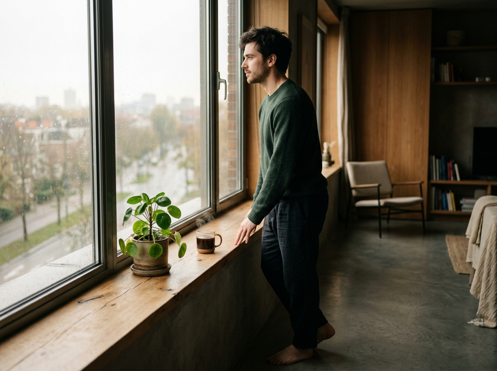

# The Exit

The wire transfer hit his bank account, and he felt absolutely nothing.

At twenty-six, my friend had just closed his second startup exit. On paper, he was winning. In reality, he was sitting alone in a dim room, staring at a laptop screen, feeling a heavy, suffocating silence. 

The money was small. Yet the price he paid was absolute. For four years, his calendar was a series of color-coded blocks, his relationships were networking opportunities, and his mind was a hyper-optimized machine. 

*Build, launch, scale, exit, repeat.*

In the tech world, this is called the dream. To him, it had become a self-inflicted prison.

When he went to celebratory dinners, the conversations were always the same: *What's the next venture? How do we scale this? Who is funding the next round?* 

It was a reductionist trap. It treated life like a funnel. You input time, health, and relationships, and you output capital and growth. But when he looked at the math of his own life, he realized the equation was fundamentally broken. He saw the flaws of reductionism—he refused to believe that his entire existence could be optimized away into a pitch deck or a valuation metric.

He was tired of the grind. But more than that, he was tired of seeing the world through the lens of transaction. When you optimize everything, nothing has room to simply grow.

"I need to escape," he told me one evening. "But I don't even know how to not work."

When you've spent your entire twenties running on treadmill speeds, standing still feels like falling. He had lost the meaning of life because he had outsourced it to milestones.

So he did something radical. He didn't start a new company. He didn't write a book. He didn't even go on a grand travel adventure. 

He started looking for meaning in the things that could never be scaled. 

He bought a single green plant for his windowsill. Every morning, before opening his phone, he watered it. He watched the dry soil turn dark and rich, learning to notice the subtle, daily growth that didn't need a presentation or an investor's approval.

He began cooking his own meals. Not fast, optimized meal-preps, but slow dinners where he sliced vegetables with care, smelling the garlic, feeling the heat of the stove. 

He started walking around his neighborhood without headphones. No podcasts at 1.5x speed. No business audiobooks. Just the sound of his own footsteps, the cool morning air, and the chatter of birds. 

He was exploring meaning not in grand achievements, but in everyday actions. He was shifting his mindset from *extracting* value from his days to *nurturing* life within them. 

He realized that we don't find meaning at the end of a long, grueling journey. We cultivate it in the small spaces we choose to tend. In the quiet brewing of coffee, the careful repair of a broken drawer, the slow conversation with a friend where no one is networking.

The prison door was never locked. It was waiting for him to step out, not to build another project, but to finally start nurturing the life he had.

***

