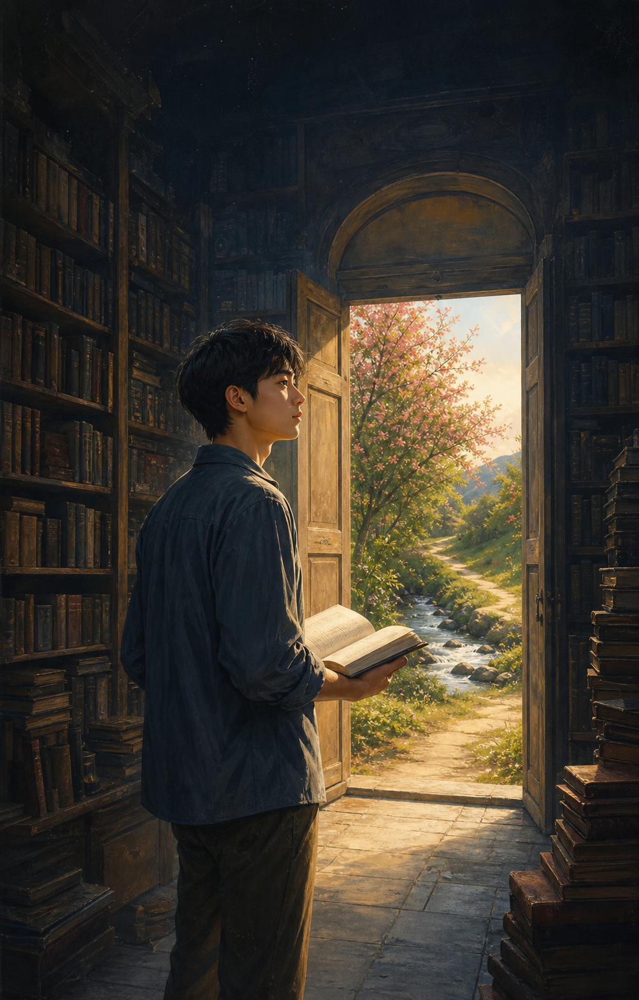

# Người Đọc Không Bước Ra Ngoài

Từ ngày còn bé, An đã tin rằng mọi câu hỏi trên đời đều có câu trả lời nằm trong một cuốn sách nào đó.

Khi những đứa trẻ khác chạy ngoài sân, An ngồi bên cửa sổ, đọc về những cánh rừng mà cậu chưa từng đặt chân tới, những dòng sông mà cậu chưa từng nhìn thấy, và những cuộc đời chỉ tồn tại giữa hai bìa sách.

Lớn lên, An đọc nhiều hơn.

Cậu đọc về lòng can đảm nhưng chưa từng bước vào một nơi khiến mình sợ hãi. Cậu đọc về tình yêu nhưng luôn từ chối một bàn tay chìa ra, vì trong sách viết rằng con người thường làm tổn thương nhau. Cậu đọc về thất bại và biết hàng trăm lý do không nên bắt đầu.

Mỗi khi ai đó kể cho An nghe một điều mới, cậu đều hỏi:

“Có tài liệu nào chứng minh không?”

Nếu câu trả lời là không, An mỉm cười.

“Vậy thì chưa đủ đáng tin.”

Một ngày nọ, An tìm thấy trong thư viện một cuốn sách không có tên tác giả. Bìa sách màu đen, không có mục lục, không có lời giới thiệu. Ở trang đầu tiên chỉ có một câu:

**Muốn hiểu cuốn sách này, hãy sống một ngày không đọc sách.**

An cau mày. Cậu lật đi lật lại cuốn sách, tìm chú thích, tìm dẫn nguồn, tìm một lời giải thích hợp lý. Không có gì cả.

Cậu quyết định làm theo, chỉ để chứng minh rằng cuốn sách vô lý.

Sáng hôm sau, An rời nhà mà không mang theo sách.

Ngoài phố, nắng chiếu xuống những mái nhà. Một người bán hoa đang cười với khách. Một đứa trẻ làm rơi quả bóng xuống vũng nước rồi bật cười. Một bà cụ ngồi trước hiên, chậm rãi gọt một quả cam.

An nhìn thấy tất cả, nhưng trong đầu cậu lập tức hiện lên những đoạn văn đã từng đọc.

Cậu không nhìn bà cụ. Cậu nhớ về một chương viết về tuổi già.

Cậu không nghe tiếng cười của đứa trẻ. Cậu phân tích nó theo một bài nghiên cứu về niềm vui.

Cậu không ngửi những bông hoa. Cậu nghĩ về tên khoa học của chúng.

Đến trưa, An đi ngang qua một cây cầu. Một cô gái đang đứng bên lan can, mắt nhìn xuống dòng nước.

An dừng lại.

Theo những gì cậu đã đọc, người lạ không nên can thiệp vào chuyện của người khác. Theo một cuốn sách khác, mọi hành động bộc phát đều có thể gây hậu quả. Theo một chương nữa, muốn giúp ai đó, trước hết phải hiểu đầy đủ nguyên nhân nỗi đau của họ.

Vì thế, An đứng yên.

Một lúc sau, cô gái quay sang hỏi:

“Anh có thể ngồi đây một lát không?”

An muốn hỏi cô đang gặp vấn đề gì, nguyên nhân từ đâu, có tiền sử tâm lý hay không, và cách hỗ trợ nào là phù hợp nhất.

Nhưng lần đầu tiên trong đời, cậu không tìm được câu trả lời trong sách.

An ngồi xuống.

Hai người im lặng nhìn dòng nước trôi.

Một lát sau, cô gái nói:

“Cảm ơn anh. Tôi chỉ cần có người ngồi cạnh.”

An không biết phải đáp gì. Cậu chưa từng đọc một chương nào về sự im lặng có ích.

Tối hôm đó, An trở về thư viện. Cậu mở cuốn sách bìa đen. Những trang giấy vẫn trắng, chỉ có câu đầu tiên nằm im lặng ở đó.

An bực bội lấy bút viết vào trang thứ hai:

“Hôm nay, tôi đã ngồi cạnh một người mà không cần hiểu hết về họ.”

Mực vừa khô, những dòng chữ mới bỗng hiện ra:

**Bây giờ, cuốn sách mới bắt đầu viết.**

An nhìn quanh thư viện. Hàng nghìn cuốn sách đứng ngay ngắn trên kệ, chứa đựng vô vàn điều đúng đắn. Nhưng lần đầu tiên, cậu hiểu rằng chúng chưa bao giờ yêu cầu cậu ở lại mãi trong đó.

Sách có thể chỉ đường đến khu rừng, nhưng không thể thay cậu chạm vào thân cây.

Sách có thể nói về đại dương, nhưng không thể làm môi cậu mặn vì nước biển.

Sách có thể dạy cậu cách sống, nhưng không thể sống thay cậu một ngày nào.

An khép cuốn sách lại.

Ngày hôm sau, cậu vẫn đọc.

Chỉ khác một điều: sau mỗi chương, An bước ra ngoài.

Và trên giá sách, cuốn sách bìa đen dần dần có thêm những trang mới — không phải do một học giả nổi tiếng viết, mà do chính những điều An đã thật sự nhìn thấy, thật sự làm, thật sự mất mát và yêu thương.

Bởi cái bẫy đáng sợ nhất của tri thức không phải là biết sai.

Mà là biết rất nhiều về cuộc đời, đến mức quên mất phải sống.
