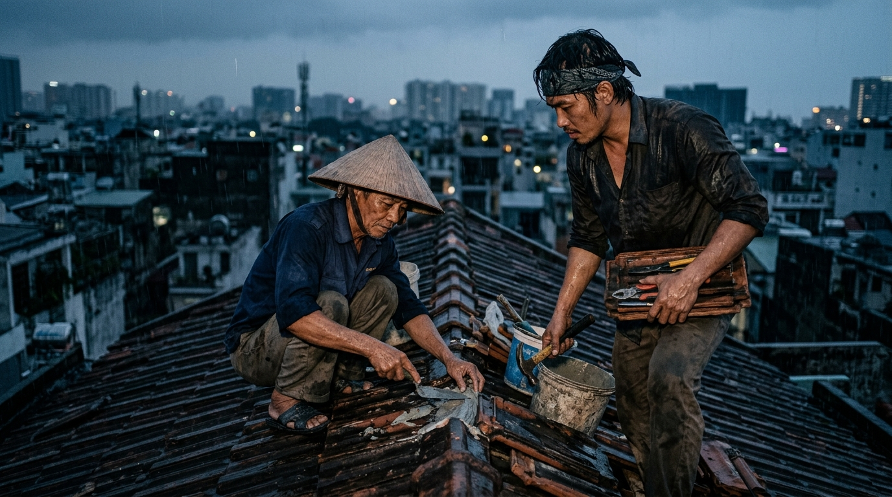

# Người Chờ Đợi Ý nghĩa không bao giờ đến

Nam đã dành trọn mười năm để chờ đợi một câu trả lời.

Trên bàn làm việc của anh là hàng chục cuốn sổ tay dày cộp, phủ kín những dòng trăn trở về sự tồn tại. Anh đọc từ triết học cổ đại đến hiện đại, lặn lội tìm đến những đỉnh núi mờ sương và ngồi hàng giờ bên khung cửa sổ ngắm nhìn dòng người hối hả ngược xuôi. Anh nhìn họ và tự hỏi với một nỗi cay đắng ngầm: *“Họ sống vì cái gì mà có thể bận rộn đến thế? Chẳng lẽ họ không nhận ra tất cả rồi cũng sẽ trở về với cát bụi sao?”*

Nam rơi vào một vực thẫm của sự vô nghĩa. Anh tin rằng trước khi bắt đầu làm bất cứ điều gì — chọn một nghề nghiệp, yêu một ai đó, hay thậm chí là trồng một cây xanh — anh phải tìm ra “Ý Nghĩa Vĩ Đại” của cuộc đời mình trước. Anh chờ đợi một khoảnh khắc bừng sáng, một tiếng gọi định mệnh, hay một sự thật hiển linh rơi xuống để chỉ cho anh biết anh sinh ra trên đời này để làm gì.

Nhưng năm tháng trôi qua, tiếng gọi ấy chưa bao giờ vang lên. Căn phòng anh ngày càng dày thêm bụi, và lòng anh ngày càng rỗng ngơ ngác.

---

Sống ngay bên cạnh nhà Nam là ông Tám, một lão thợ mộc già ngoài sáu mươi. Tay ông Tám chai sạn, mặt hằn sâu những vết chân chim, và cả ngày ông chỉ quanh quẩn với đống gỗ vụn, cưa, đục và phoi bào. Nam từng nhìn ông với vẻ thương hại. Anh nghĩ ông Tám là một người đơn giản, cả đời chưa từng ngẩng đầu lên để trăn trở về những điều cao xa của nhân thế.

Một chiều thu mưa tầm tã, mái hiên cũ trong căn phòng của Nam bị thủng một khoảng lớn. Nước mưa dội xuống lênh láng, chảy tràn qua kệ sách và làm ướt sũng những cuốn sổ ghi chép triết học mà anh nâng niu nhất. Nam đứng gạt nước trong vô vọng, lòng tràn ngập cảm giác bất lực và chán nản. Anh thấy căn nhà dột này cũng giống hệt cuộc đời anh: xập xệ, trống rỗng và dường như chẳng có lý do gì để tồn tại.

Đúng lúc đó, ông Tám bước sang. Không hỏi han dài dòng, ông quăng cho Nam một chiếc áo mưa tiện lợi, một xô đinh, vài tấm bạt nhựa và chiếc búa nặng trịch.

*“Đứng đó thở dài thì đến sang năm nước vẫn dột vào đầu. Trèo lên mái nhà với tôi!”* — Ông Tám hô to qua tiếng mưa rào.

Nam ngập ngừng, nhưng trước sự dứt khoát của người thợ mộc già, anh đành leo lên chiếc thang gỗ ướt sũng.

---

Trời mưa như trút nước vào mặt. Trên mái nhà trơn trượt, Nam phải gồng mình giữ thăng bằng. Đôi bàn tay vốn chỉ quen cầm bút của anh run lên vì lạnh và vất vả. 

Ông Tám giữ bạt, còn Nam phải đóng từng chiếc đinh vào xà gỗ. Chiếc búa nặng trịch làm tay anh mỏi lừ. Một lần trượt tay, đầu búa đập vào ngón cái đau nhói, máu ứa ra hòa cùng nước mưa. Đất cát, rêu mốc trên mái nhà bám đầy vào mặt, vào áo quần anh. 

Trong suốt hai tiếng đồng hồ chiến đấu với trận mưa, Nam phải tập trung cao độ vào từng nhịp đập của búa, từng mép bạt cần kéo căng, từng điểm buộc dây nhựa. Anh không còn một giây phút nào để nghĩ về vũ trụ, về định mệnh, hay về sự vô nghĩa của kiếp người. Tất cả những gì tồn tại trong đầu anh lúc đó chỉ là: **Làm sao để mái nhà này hết dột.**

---

Khi tấm bạt cuối cùng được cố định chắc chắn và dòng nước dừng chảy, hai người leo xuống. Nam ngồi bệt xuống bậc hiên, toàn thân ướt sũng, mồ hôi trộn lẫn nước mưa, ngón tay nhức nhối. Nhưng khi nhìn lên mái hiên giờ đây đã vững vàng và lắng nghe tiếng mưa rơi rào rạt bên ngoài mà không còn một giọt nước nào dột vào nhà, một cảm giác kỳ lạ bỗng dâng lên trong lồng ngực anh.

Nó không phải là sự phấn khởi tột cùng, mà là một niềm bình yên nguyên bản, ấm áp và vô cùng chân thật.

Ông Tám rót cho anh một chén trà nóng ngút khói, nhìn ngón tay sưng tấy của Nam rồi nói nhẹ nhàng:

> *“Cậu Nam này, cái mái nhà nó không tự hết dột bằng cách cậu ngồi ngắm nó. Cuộc đời cậu cũng vậy thôi. Cậu cứ ngồi trong phòng chờ ai đó mang ‘ý nghĩa’ đến giao tận tay như một bức thư. Nhưng ý nghĩa làm gì có chân mà tự đi?”*

Ông Tám nhấp một ngụm trà, chỉ tay về phía xưởng mộc của mình:

> *“Khúc gỗ thô dưới xưởng của tôi, ban đầu nó chẳng là cái gì cả. Nó chỉ là ý nghĩa khi tôi bỏ công đục đẽo nó thành cái bàn cho đứa trẻ học bài, thành cái ghế cho người già nghỉ chân. Ý nghĩa không nằm sẵn trong khúc gỗ. Ý nghĩa là thứ mình đổ mồ hôi tạo ra cho nó mỗi ngày.”*

---

Nam ngồi lặng đi giữa tiếng mưa. 

Anh nhìn xuống đôi bàn tay lấm lem đất cát, nhìn ngón tay đang sưng đỏ của mình. Lần đầu tiên sau mười năm, anh nhận ra sai lầm lớn nhất của đời mình: **Anh đã biến ý nghĩa thành một danh từ để đi tìm, thay vì một động từ để thực hiện.**

Ý nghĩa cuộc sống chưa bao giờ là một kho báu bị giấu sẵn dưới lòng đất để chờ người đến nhặt. Nó cũng không phải là một chiếc chìa khóa vạn năng rơi từ trên trời xuống. 

Ý nghĩa là thứ được nhào nặn hàng ngày:
* Khi bạn chìa tay giúp một người xóm giềng trong trận mưa.
* Khi bạn dọn dẹp gọn gàng một góc phòng tối.
* Khi bạn kiên nhẫn lắng nghe một ai đó.
* Khi bạn đổ mồ hôi hoàn thành một công việc, dù là nhỏ nhất.

Tối hôm đó, Nam trở về phòng. Anh không mở những cuốn sổ triết học ra nữa. Anh lau sạch vết bẩn trên bàn, dán băng cá nhân vào ngón tay đau, và mở cửa sổ nhìn ra cơn mưa đêm. 

Anh biết rằng ngày mai trời sẽ lại sáng, và anh sẽ không ngồi chờ đợi nữa. Anh sẽ bước ra ngoài và bắt đầu tự tay nhào nặn nên ý nghĩa cho ngày mới của chính mình.
