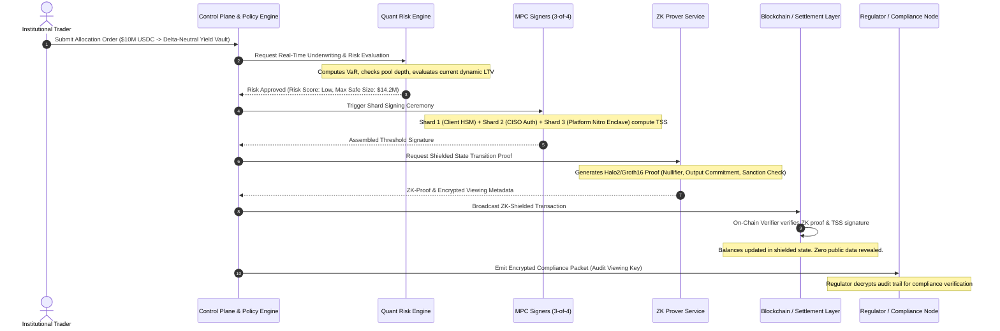

# Architectural Specification: The Sovereign Financial Stack
**MPC Custody, ZK Privacy, and Quant-Curated Risk Architecture**

---

## 1. Pillar I: Enterprise MPC Custody Engine

Traditional private key storage creates single points of failure (SPOFs) that are unacceptable for institutional fiduciary mandates. Our custody layer replaces raw private keys with **Multi-Party Computation (MPC) Threshold Signature Schemes (TSS)** combined with hardware-isolated execution environments.

### 1.1 Cryptographic Core & Protocol Specs
- **Supported Curves & Algorithms:**
  - **ECDSA (secp256k1):** Native compatibility with Bitcoin, Ethereum, and EVM-compatible networks.
  - **EdDSA (Ed25519):** Native compatibility with Solana, Near, Aptos, Sui, and Cosmos ecosystems.
  - **TSS Protocol Standard:** Implementation of **CGGMP21** (Canetti et al., 2021) for ECDSA and **FROST** (Flexible Round-Optimized Schnorr Threshold) for Ed25519.
  - **Key Properties:** Non-interactive signing options, identifiable aborts (identifies malicious or offline nodes immediately), and proactive security.

### 1.2 Key Generation & Shard Topology (3-of-4 Hybrid Institutional Model)
Private keys never exist in complete form at any point in the lifecycle—neither at generation, storage, nor execution.

```
       ┌─────────────────────────────────────────────────────────────┐
       │                DISTRIBUTED KEY GENERATION (DKG)             │
       └──────────────────────────────┬──────────────────────────────┘
                                      │
            ┌─────────────────────────┼─────────────────────────┐
            │                         │                         │
            ▼                         ▼                         ▼
   ┌─────────────────┐       ┌─────────────────┐       ┌─────────────────┐
   │    Shard #1     │       │    Shard #2     │       │    Shard #3     │
   │  Client Primary │       │ Enterprise CISO │       │ Institutional   │
   │  (FIPS 140-3 L3 │       │ (Air-gapped Cold│       │ Provider Cloud  │
   │   Cloud HSM)    │       │  Hardware Key)  │       │ (Nitro Enclave) │
   └─────────────────┘       └─────────────────┘       └─────────────────┘
                                      │
                                      ▼
                             ┌─────────────────┐
                             │    Shard #4     │
                             │ Backup / Escrow │
                             │ (Regulated Trust│
                             │  Custodian Co.) │
                             └─────────────────┘
```

- **Threshold Quorum ($t$-of-$n$):** Standard baseline is **3-of-4**:
  - *Shard 1 (Client Hot/Warm):* AWS CloudHSM / Azure Dedicated HSM under enterprise control.
  - *Shard 2 (Client CISO / Cold Approval):* Hardware device (YubiKey Bio / Ledger Enterprise) held by authorized compliance officers.
  - *Shard 3 (Platform Co-signer Engine):* Hosted within AWS Nitro Enclave / GCP Confidential Space running the automated policy validation engine.
  - *Shard 4 (Disaster Recovery / Legal Escrow):* Multi-region cold vault managed by a regulated third-party trust company under strict legal escrow triggers.
- **Proactive Secret Sharing (Key Refresh):**
  - Cryptographic key shares are dynamically rotated every 24 hours (or on-demand post-incident) without altering the underlying public address or on-chain assets. Even if an attacker compromises a shard, old shards become mathematically useless before an additional threshold can be breached.

### 1.3 Enterprise Policy & Velocity Engine
Before Shard 3 participates in any signing ceremony, the transaction payload passes through an immutable, real-time deterministic policy evaluator:
- **Role-Based Access Control (RBAC):** Tiered roles (Trader, Risk Officer, Compliance Approver, Super Admin).
- **Time-Lock & Multi-Signature Hierarchies:**
  - Standard operations (< $500,000): Requires Trader + Shard 1 + Shard 3 auto-approval.
  - High-value transfers ($500,000 - $10,000,000): Enforces a mandatory 60-minute time-delay and dual-officer biometric approval.
  - Critical treasury reallocations (> $10,000,000): Requires Board/C-Suite 3-of-4 authorization and 24-hour cool-off period.
- **Dynamic Address Allowlisting & Sanctions Screening:** Real-time pre-execution validation against Chainalysis/Elliptic oracle APIs for sanctioned addresses and blacklisted mixers.

---

## 2. Pillar II: Zero-Knowledge Privacy & Selective Regulatory Disclosure

Institutions face a paradox: **commercial confidentiality is mandatory** (to avoid front-running, predatory MEV, and competitive intelligence leaks), yet **regulatory compliance is non-negotiable** (BSA, FinCEN, FATF Travel Rule, MiCA, SEC reporting).

Our ZK engine bridges this gap by decoupling **validity verification** from **data exposure**.

```
┌────────────────────────────────────────────────────────────────────────────────────────┐
│                                 ZK PRIVACY ARCHITECTURE                                │
└──────────────────────────────────────────┬─────────────────────────────────────────────┘
                                           │
         ┌─────────────────────────────────┴─────────────────────────────────┐
         │                                                                   │
         ▼                                                                   ▼
 ┌───────────────────────────────┐                   ┌───────────────────────────────┐
 │      SHIELDED LEDGER          │                   │     SELECTIVE DISCLOSURE      │
 │  • Confidential Balances      │                   │  • Regulatory Viewing Keys    │
 │  • Private Counterparties     │                   │  • ZK-KYC / Sanction Proofs   │
 │  • Hidden Trade Sizes         │                   │  • Automated Proof of Solvency│
 └───────────────┬───────────────┘                   └───────────────┬───────────────┘
                 │                                                   │
                 └─────────────────────────┬─────────────────────────┘
                                           │
                                           ▼
                 ┌───────────────────────────────────────────────────┐
                 │       ON-CHAIN VERIFIER SMART CONTRACT            │
                 │   • Succinct Proof Verification (< 300k gas)      │
                 │   • Zero Information Leaked to Block Explorers    │
                 └───────────────────────────────────────────────────┘
```

### 2.1 Cryptographic Proving Scheme
- **Proving System:** Hybrid **Plonky2 / Halo2** (and Groth16 for ultra-compact EVM settlement):
  - Fast proof generation (< 1.5 seconds on client workstations or confidential server enclaves).
  - No trusted setup required (in transparent PLONK / Halo2 modes) or battle-tested universal CRS.
- **UTXO / Shielded Account State:**
  - Assets deposited into the enterprise vault receive cryptographic commitments (Pedersen commitments) stored in an on-chain Sparse Merkle Tree (SMT).
  - Transactions consume spent nullifiers and generate new output commitments without revealing sender, receiver, token type, or transfer amount.

### 2.2 Selective Disclosure & Regulatory Viewing Keys
To satisfy regulatory scrutiny without exposing corporate positions to the public internet:
1. **Auditor Viewing Keys (Role-Restricted):**
   - Cryptographic asymmetric keys (e.g., based on ElGamal or Jubjub keypairs) that allow designated regulators (FINMA, MAS, SEC, FCA) or internal audit teams to decrypt transaction metadata and trace specific balance histories.
   - Granular time-bound and asset-bound viewing keys: An auditor can be granted read-only visibility into Q3 2026 transactions for EUR stablecoins without decrypting the firm's broader portfolio.
2. **ZK-KYC & Sanction Compliance Circuits:**
   - Instead of transmitting raw PII across public mempools, the user generates a ZK proof asserting:
     $$\text{Proof} = \mathcal{ZK}\left\{ \text{Identity} \notin \text{OFAC\_Sanction\_Merkle\_Root} \land \text{Jurisdiction} \in \text{Approved\_List} \land \text{RiskScore} < 40 \right\}$$
   - Settlement nodes verify this mathematical fact without ever seeing the counterparty’s legal name, tax ID, or home address.
3. **ZK Proof of Solvency & Reserves:**
   - Daily automated computation of all liabilities and assets via Merkle-sum trees.
   - Proves $\sum \text{Assets} \ge \sum \text{Liabilities}$ without disclosing individual account balances, customer names, or specific vault allocations.

---

## 3. Pillar III: Quant Risk Curation & Dynamic Underwriting Engine

Decentralized financial instruments fail at the institutional level because they rely on static risk parameters (e.g., fixed 80% LTV, static liquidation fees) that blow up during tail-risk liquidity shocks.

Our **Quant Risk Curation Layer** acts as an institutional-grade automated risk officer, conducting real-time continuous underwriting, dynamic collateral parameterization, and programmatic vault management.

```
┌────────────────────────────────────────────────────────────────────────────────────────┐
│                              QUANT RISK ENGINE PIPELINE                                │
└──────────────────────────────────────────┬─────────────────────────────────────────────┘
                                           │
         ┌─────────────────────────────────┼─────────────────────────────────┐
         ▼                                 ▼                                 ▼
┌──────────────────┐             ┌───────────────────┐             ┌──────────────────┐
│ Market Telemetry │             │ Quantitative Risk │             │ Automated Action │
│  & Orderbook L2  │             │   Model Core      │             │  & Circuit Guard │
├──────────────────┤             ├───────────────────┤             ├──────────────────┤
│ • CeFi Depth     │ ──Stream──> │ • Real-Time VaR   │ ──Triggers─>│ • Dynamic LTV    │
│ • DEX AMM Pools  │  WebSocket  │ • CVaR / ES (99%) │   Updates   │ • Haircut Engine │
│ • Historical Vol │    Feed     │ • Contagion Tree  │             │ • Delta Hedging  │
│ • Liquidity Gaps │             │ • Slippage Curves │             │ • Hard Circuit   │
└──────────────────┘             └───────────────────┘             │   Breakers       │
                                                                   └──────────────────┘
```

### 3.1 Quantitative Risk Modeling & Underwriting Core
- **Dynamic LTV & Haircut Adjustment:**
  Instead of hardcoded collateral parameters, the risk engine calculates Loan-to-Value thresholds as an empirical function of market depth, realized volatility, and asset concentration:
  $$\text{LTV}_{\text{dynamic}} = \min\left(\text{LTV}_{\text{base}}, \; \kappa \cdot \frac{\mathcal{D}_{\text{10min}}(slippage \le 2\%)}{\text{Outstanding Debt}} \cdot \frac{1}{\sigma_{\text{realized}} \sqrt{\Delta t}}\right)$$
  - When liquidity thins or volatility spikes, collateral requirements tighten autonomously before liquidations become chaotic.
- **Value at Risk (VaR) & Expected Shortfall (CVaR):**
  - 99% Parametric and Monte Carlo VaR models calculated over continuous 1-second rolling windows across all supported collateral and synthetic pairs.
  - Sub-second stress simulation against historical historical crises (March 2020 COVID shock, May 2022 Terra collapse, November 2022 FTX unwind).
- **Curated ERC-4626 Multi-Strategy Vaults:**
  - Segregated institutional strategy vaults partitioned by risk appetite:
    - *Conservative (Prime Cash / T-Bill Equivalent):* Short-dated tokenized treasuries, overcollateralized prime lending, delta-neutral basis trades.
    - *Balanced (Market Neutral Yield):* Cross-venue arbitrage, stETH/ETH staking spreads, dynamic LPing with automatic range hedging.
    - *Aggressive (DeFi Tactical Alpha):* Curated leverage, structured credit tranches, cross-chain yield optimization.

### 3.2 Automated Liquidations, Telemetry, and Circuit Breakers
- **Dutch Auction & MEV-Shielded Liquidations:**
  - Liquidations bypass public mempools to avoid toxic front-running or sandwich attacks.
  - Executed via private CoW (Coincidence of Wants) auctions and pre-integrated institutional market makers (Wintermute, Flow Traders, Jane Street).
- **Programmatic Circuit Breakers (VolGuard):**
  - **Level 1 (Soft Halt - 5% price drift in 5 mins):** Disables new borrowing and caps leverage to 1x; triggers real-time alerts to risk desks.
  - **Level 2 (Vault Freeze - 15% asset drawdown or cross-oracle divergence > 1.5%):** Suspends deposit/borrowing actions, keeps collateral repay channels open, shifts automated market-maker vaults into delta-neutral stable assets.

---

## 4. End-to-End Operational Lifecycle: The Life of an Institutional Transaction

The true power of this architecture lies in how seamlessly the three pillars interlock during live capital deployment.



### Step-by-Step Execution Narrative
1. **Initiation:** Institutional portfolio manager submits an order via FIX protocol or REST/gRPC dashboard.
2. **Quant Risk Pre-Flight Check:** The transaction is routed to the Quant Risk Engine. It executes simulated stress-testing, verifies portfolio margin limits, and inspects counterparty liquidity.
3. **Policy & MPC Ceremony:** Once risk-cleared, the transaction payload hits the MPC policy engine. If authorization rules pass (quorum thresholds, velocity checks), Shards 1, 2, and 3 collaborate across hardware enclaves to construct the threshold signature without reconstructing the private key.
4. **Zero-Knowledge Proof Generation:** The signed intent enters the local ZK Prover. It generates a proof verifying asset validity, sufficient balance, and absence from blacklists, encrypting the transaction details with the institutional compliance officer's and regulator's viewing keys.
5. **Execution & Confidential Settlement:** The transaction is broadcast to the network. On-chain verifier contracts validate the cryptographic proof in milliseconds. Mempool watchers see only randomized cryptographic commitments.
6. **Regulatory Assurance:** Regulators inspect the ledger via their designated viewing keys, confirming full compliance with anti-money laundering and tax mandates in real time.
