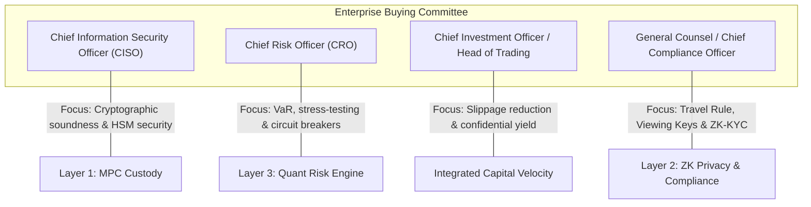

# Institutional Go-To-Market & Commercial Strategy
**Selling the Unified Sovereign Financial Stack to Enterprise Capital**

---

## 1. Executive Commercial Thesis

Enterprise buyers do not buy standalone cryptographic primitives; they buy **risk mitigation, regulatory air cover, and capital efficiency**.

When selling to institutions, attempting to sell MPC custody, ZK privacy, or quant risk tools in isolation yields protracted sales cycles and endless vendor integration headaches:
- Selling **Custody only** commoditizes you against legacy custodians (Fireblocks, Copper, Anchorage) who compete on price.
- Selling **ZK Privacy only** terrifies compliance teams, who immediately associate zero-knowledge with Tornado Cash and regulatory enforcement actions.
- Selling **Quant Risk/Yield only** forces institutions to trust unproven smart contract pools with exposed public balances and static risk parameters.

**The Winning Enterprise Pitch:**
> *"We provide the first unified institutional capital operating system that allows you to safeguard tier-1 assets (MPC), execute discreetly without leaking commercial alpha (ZK), and maximize risk-adjusted yields via real-time algorithmic underwriting (Quant)—all within an audit-ready regulatory framework."*

---

## 2. Ideal Customer Profiles (ICPs) & Target Segments

```
┌────────────────────────────────────────────────────────────────────────────────────────┐
│                                 ICP SEGMENTATION MATRIX                                │
├─────────────────────────┬──────────────────────────┬───────────────────────────────────┤
│ Segment                 │ Primary Pain Point       │ Killer Feature Value Driver       │
├─────────────────────────┼──────────────────────────┼───────────────────────────────────┤
│ Tier-1 & Regional Banks │ Regulatory compliance,   │ ZK Viewing Keys for Regulators &  │
│ (Digital Asset Desks)   │ FIPS-140 HSM security    │ Institutional MPC Shard Governance│
├─────────────────────────┼──────────────────────────┼───────────────────────────────────┤
│ Macro & Crypto          │ MEV front-running,       │ Shielded Balances/Trading +       │
│ Quantitative Funds      │ market impact, alpha leak│ Dynamic VaR-based Margin Curation │
├─────────────────────────┼──────────────────────────┼───────────────────────────────────┤
│ Private Wealth Offices  │ Confidentiality of high- │ Non-custodial 3-of-4 MPC +        │
│ & Family Foundations    │ net-worth allocations    │ Automated Proof of Solvency       │
├─────────────────────────┼──────────────────────────┼───────────────────────────────────┤
│ Web3 Protocol           │ Treasury concentration,  │ Curated ERC-4626 Vaults with      │
│ Foundations / DAOs      │ idle capital volatility  │ VolGuard Circuit Breakers         │
└─────────────────────────┴──────────────────────────┴───────────────────────────────────┘
```

### Segment 1: Global & Regional Investment Banks
- **Profile:** Tier-1/Tier-2 institutions launching digital asset prime brokerage or tokenized bond/RWA trading desks (e.g., J.P. Morgan Onyx, BNY Mellon, Standard Chartered / Zodia).
- **Core Motivation:** Entering crypto without violating Basel III capital adequacy guidelines, FATF Travel Rule, or internal risk tolerance.
- **Decision Criteria:** SOC2 Type II, ISO 27001, dual-custody legal isolation, non-custodial software licenses.

### Segment 2: Quantitative Hedge Funds & Proprietary Trading Desks
- **Profile:** Systematic digital asset funds managing $50M to $2B+ AUM (e.g., Brevan Howard Digital, Jump Crypto, Galaxy Digital).
- **Core Motivation:** Deploying multi-million dollar positions into liquid staking and lending markets without competitors reverse-engineering their wallet addresses or toxic MEV sandwich bots draining execution basis points.
- **Decision Criteria:** Sub-millisecond signing latency, shielded order execution, dynamic LTVs to prevent premature liquidations during market wicks.

### Segment 3: Private Banks & Multi-Family Offices
- **Profile:** Wealth managers in Switzerland, Singapore, UAE, and the US managing ultra-high-net-worth (UHNW) allocations.
- **Core Motivation:** Total financial privacy from public scrutiny combined with complete auditability for national tax authorities and inheritance trustees.
- **Decision Criteria:** Client-held hardware shards, zero public tracking on block explorers, verifiable reporting for family principals.

---

## 3. Buying Committee Alignment & Persona Playbook

Enterprise sales cycles in financial infrastructure involve 4 distinct stakeholders. If any single stakeholder vetoes, the deal dies.



### 1. The CISO (Chief Information Security Officer)
- **Primary Concern:** Private key leakage, insider collusion, cloud dependency.
- **Our Value Pitch:**
  - Zero raw private keys exist at any point in the system lifecycle.
  - CGGMP21 threshold cryptography guarantees that no rogue employee or compromised cloud credential can authorize a withdrawal.
  - Hardware isolation in FIPS 140-3 Level 3 HSMs and AWS Nitro Enclaves.
  - Automated 24-hour proactive secret sharing (key shard rotation).

### 2. The CRO (Chief Risk Officer)
- **Primary Concern:** Smart contract insolvency, cascading bad debt, toxic liquidation cascades, counterparty default.
- **Our Value Pitch:**
  - Dynamic LTV algorithms replace arbitrary, static governance parameters with live orderbook depth and volatility metrics.
  - Sub-second Monte Carlo VaR (99%) simulation.
  - Programmatic VolGuard circuit breakers that freeze vulnerable borrowing channels before liquidation cascades occur.
  - Dutch-auction liquidation engine executed via pre-screened institutional market makers, avoiding public mempools.

### 3. The CIO / Head of Trading
- **Primary Concern:** Front-running, MEV leakage, predatory copy-trading, capital inefficiency.
- **Our Value Pitch:**
  - Complete zero-knowledge state shielding: public block explorers see zero trading sizes, counterparty addresses, or inventory balances.
  - Up to 35% higher capital efficiency through curated collateral pools and risk-adjusted margin models.
  - Single-dashboard orchestration across CeFi and DeFi execution venues.

### 4. General Counsel & Chief Compliance Officer (CCO)
- **Primary Concern:** OFAC sanctions, regulatory enforcement, FinCEN/FATF Travel Rule non-compliance, criminal liability.
- **Our Value Pitch:**
  - Selective disclosure via asymmetric **Auditor Viewing Keys**: Provide regulators read-only mathematical proofs of full compliance without broadcasting corporate secrets publicly.
  - ZK-KYC and Sanctions Predicates: Proof of non-sanctioned status verified mathematically at the protocol level.
  - Daily, automated cryptographic Proof of Solvency.

---

## 4. Packaging & Enterprise Deployment Models

| Deployment Model | Target Audience | Description | Control Profile |
| :--- | :--- | :--- | :--- |
| **Model A: Institutional Cloud (SaaS + Enclave)** | Hedge Funds, Wealth Managers, Web3 Treasuries | Fully managed orchestration plane; Shard 1 held in client HSM, Shard 2 held on user hardware, Shard 3 hosted in managed Nitro Enclaves. | Non-custodial; zero platform access to client assets. Rapid 2-week deployment. |
| **Model B: Virtual Private Cloud (VPC Dedicated)** | Regional Banks, Asset Managers ($1B+ AUM) | All components deployed into the client’s dedicated AWS/GCP/Azure VPC via Terraform / Kubernetes blueprints. Platform provides managed updates and risk telemetry. | Complete infrastructure sovereignty; meets strict data residency laws. |
| **Model C: On-Premise Air-Gapped Hybrid** | Tier-1 Global Investment Banks, Central Banks | Core MPC shards and ZK provers deployed in on-premise Tier-4 data centers with dedicated physical HSM modules (Thales/nCipher). | Maximum security; 3-6 month integration timeline. |

---

## 5. Pricing Architecture

To capture value while lowering institutional barriers to entry, the pricing model combines a high-margin recurring software license with capital-aligned performance fees.

### 1. Annual Platform License Fee (Base ARR)
- **Tier 1 (Hedge Fund / Wealth Desk):** $150,000 / year (Up to 10 user seats, standard MPC quorum, standard risk models).
- **Tier 2 (Enterprise Asset Manager):** $350,000 / year (Unlimited seats, dedicated VPC deployment, custom ZK viewing keys, 24/7 SLA).
- **Tier 3 (Tier-1 Bank / Prime Broker):** $750,000+ / year (Custom on-prem deployment, custom quant risk underwriting development, dedicated cryptographer support).

### 2. Assets Under Management (AUM) Tiered Bps
- **Tiered Volume Pricing on Active Vault Collateral:**
  - First $100M AUM: **15 bps** (0.15%) annually.
  - Next $400M AUM: **10 bps** (0.10%) annually.
  - Above $500M AUM: **5 bps** (0.05%) annually.

### 3. Professional Services & Implementation
- **Standard Onboarding & Security Deployment:** $50,000 flat fee.
- **Custom Smart Contract / Quant Strategy Modeling:** $100,000 - $250,000 (bespoke risk curves, tailor-made tokenized collateral models).

---

## 6. Enterprise Objection Handling & Battlecards

### Objection 1: "Regulators hate privacy and zero-knowledge tools. Won't using ZK get us investigated?"
> **Rebuttal:**  
> *"Regulators do not oppose cryptographic privacy; they oppose illicit opacity. Public blockchains force an absurd choice: broadcast your proprietary trade secrets to Chinese and Russian bots, or don't participate.  
> Our ZK engine is built specifically for compliance: it features **Auditor Viewing Keys** and **ZK Sanction Predicates**. You can generate a single cryptographic audit package that proves to the SEC, FINMA, or your internal auditors that 100% of your trades complied with KYC, sanctions, and tax laws—without exposing your proprietary books to the public."*

### Objection 2: "We already use Fireblocks / Copper for custody. Why replace them?"
> **Rebuttal:**  
> *"Fireblocks is exceptional at raw key storage, but it was built for the 2019 era of public-chain trading. When your traders use Fireblocks today, every single trade, treasury movement, and vault deposit is visible on Etherscan in 12 seconds. Competitors copy your trades, MEV bots front-run your orders, and your alpha is drained.  
> Furthermore, traditional custodians have zero automated quant underwriting: if a lending protocol you deposit into undergoes a liquidity crunch, your custodian cannot calculate dynamic LTVs or trigger automated circuit breakers. We don't just store keys; we shield your transactions and protect your balance sheet with automated quantitative risk curation."*

### Objection 3: "Isn't ZK proof generation too computationally slow for institutional trading?"
> **Rebuttal:**  
> *"That was true three years ago with legacy SNARK architectures. Our stack leverages modern PLONK and Halo2 schemes, optimized with GPU-accelerated prover pipelines running in secure enclaves. Standard state transition proofs generate in under 1.2 seconds, perfectly aligning with block times on modern L1s and institutional L2 settlement rollups. For high-frequency off-chain execution, transactions match in shielded off-chain orderbooks and settle on-chain in aggregated batch proofs."*

---

## 7. Institutional Enterprise Sales Funnel (90-Day Plan)

```
┌────────────────────────────────────────────────────────────────────────────────────────┐
│                                 90-DAY SALES CADENCE                                   │
├────────────────────┬────────────────────┬────────────────────┬────────────────────────┤
│ Day 1 - 15:        │ Day 16 - 45:       │ Day 46 - 70:       │ Day 71 - 90:           │
│ Discovery & Align  │ Technical POC      │ Risk & Legal Audit │ Production Deployment  │
├────────────────────┼────────────────────┼────────────────────┼────────────────────────┤
│ • Map buying       │ • Deploy sandbox   │ • Legal sign-off   │ • Shard generation     │
│   committee        │   VPC enclave      │   on Viewing Keys  │   ceremony in HSMs     │
│ • Quant portfolio  │ • 3-of-4 MPC shard │ • SOC2 Type II     │ • Initial $25M-50M     │
│   stress-test audit│   ceremony demo    │   review           │   capital allocation   │
│ • Identify MEV &   │ • ZK test proof &  │ • Master Service   │ • 24/7 operational     │
│   alpha leakage    │   auditor decrypt  │   Agreement (MSA)  │   risk monitoring live │
└────────────────────┴────────────────────┴────────────────────┴────────────────────────┘
```
