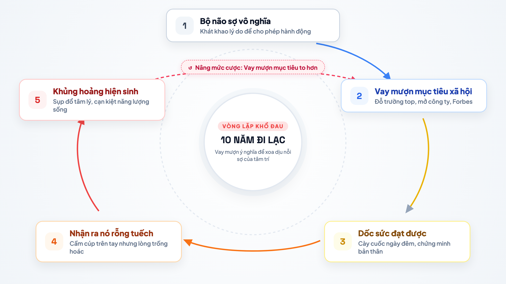

# 10 năm đi lạc trong những ý nghĩa sống vay mượn

Hiện tại tôi 26 tuổi. Khi ngồi nhìn lại quãng đường gần một thập kỷ qua, tôi thấy mình giống như một người vừa bước ra khỏi một cơn mê dài.

Một cơn mê mang tên: đi tìm ý nghĩa cuộc đời.

Suốt 10 năm, từ lúc 16, 17 tuổi cho tới gần đây, trong đầu tôi luôn bị đóng đinh bởi một niềm tin: phải có ý nghĩa thì mới được hành động. Ý nghĩa phải đi trước, việc làm mới theo sau. Tôi không thể nhấc tay làm bất cứ điều gì nếu không tự thuyết phục được rằng việc đó mang một giá trị to lớn nào đó cho cuộc đời mình.

Thế nhưng, bộ não con người vốn dĩ rất sợ cảm giác trống rỗng. Nó sợ việc tồn tại mà không có lý do. Để xoa dịu nỗi sợ đó, nó chọn con đường nhanh nhất: vơ vội những ý nghĩa có sẵn ngoài môi trường, những thứ mà bố mẹ và xã hội đã dán nhãn sẵn là "thành công" và "đáng sống".

Thế là tôi bắt đầu ký vào những bản hợp đồng vay mượn.

Năm 18 tuổi, tôi tin rằng ý nghĩa lớn nhất đời mình lúc đó là phải đỗ vào một trường đại học top đầu. Tôi cày ngày cày đêm, dốc cạn sức lực và tôi đạt được nó. Nhưng niềm vui hân hoan khi nhận giấy báo đỗ chỉ ở lại vỏn vẹn vài tuần. Sau những lời chúc tụng của người thân, khi ngồi một mình trong căn phòng trọ, cảm giác trống hoác quen thuộc lại trồi lên. Tôi tự hỏi: rồi sao nữa?

Bộ não của tôi lập tức hoảng sợ trước câu hỏi đó. Nó vội vàng đi tìm một ý nghĩa khác để lấp vào chỗ trống.

Năm 22 tuổi, nó bảo tôi rằng ý nghĩa thực sự nằm ở ngoài thương trường: phải mở công ty riêng, phải tự làm chủ và kiếm thật nhiều tiền. Tôi lại lao vào làm việc như điên. Tôi lập công ty, chèo chống qua những giai đoạn khó khăn, đạt được những cột mốc doanh thu và thành công tài chính mà bạn bè đồng trang lứa hằng mơ ước. Thế nhưng, kỳ lạ thay, khi nhìn vào số dư tài khoản hay những bản báo cáo kinh doanh khởi sắc, lồng ngực tôi vẫn cứ nghẹn lại. Cảm giác vô nghĩa một lần nữa quay trở lại bóp nghẹt tôi.

Chiếc cúp đã cầm chắc trên tay, nhưng câu trả lời cho sự tồn tại thì vẫn bặt vô âm tín.

Không chịu đầu hàng, bộ não tôi lại tiếp tục nâng mức cược lên cao hơn. Nó vẽ ra một đích đến lộng lẫy hơn: năm 28 tuổi, tôi phải lọt vào danh sách Forbes Under 30. Tôi lại tự nhủ rằng chỉ cần có được sự công nhận đỉnh cao đó, cuộc đời mình mới thực sự có ý nghĩa và tâm mình mới có thể yên ổn.

Nhưng tôi đã không bao giờ đi tới năm 28 tuổi với mục tiêu đó.

Năm 25 tuổi, một biến cố tâm lý nặng nề ập đến. Nó như giọt nước làm tràn một chiếc ly vốn đã rạn nứt từ lâu. Trong những ngày tháng suy sụp và kiệt quệ nhất, khi toàn bộ năng lượng sống cạn đáy, tôi mới bàng hoàng nhìn thấy cái vòng lặp quái ác mà mình đã mắc kẹt suốt 10 năm:

Tôi nhận ra sự thật cay đắng: nếu tôi cứ tiếp tục cuộc đua này, thì dù năm 28 tuổi tôi có được vinh danh trên Forbes, thì chỉ hai tuần sau lễ trao giải, cảm giác rỗng tuếch và hoảng loạn cũng sẽ quay lại nuốt chửng tôi. Cái giá phải trả cho 10 năm qua không phải là thất bại, mà là sự kiệt sức vì đã sống trọn vẹn một cuộc đời bằng những lý do của người khác.

Tôi không muốn tiếp tục cái vòng lặp khổ sở này nữa. Tôi quyết định dừng lại, buông bỏ cuộc đua danh vọng và tìm đến học Phật pháp.

Khi bình tâm lại để quan sát cuộc đời, tôi nhận ra một sự thật đơn giản đến mức làm tôi bật cười:

**Vũ trụ này vốn tự nó đâu có ý nghĩa từ ban đầu.**

Cái cây ngoài ban công cứ thế đâm chồi, xanh lá rồi rụng lá, nó đâu cần một ý nghĩa nào mới chịu mọc. Mặt trời mỗi sớm mai vẫn cứ mọc ở đằng đông và lặn ở đằng tây, nó đâu cần một bản tuyên ngôn sứ mệnh nào để chiếu sáng.

Bản chất thế giới này vận hành trên nhân quả, không vận hành trên ý nghĩa. Gieo hạt xuống đất ẩm thì cây nảy mầm, có nắng có nước thì cây lớn lên. Tự nhiên chưa từng ngồi đó để gán sẵn một "ý nghĩa thiêng liêng" nào cho bất kỳ sinh vật nào.

Hóa ra suốt 10 năm qua, tôi đã miệt mài giải một bài toán vô nghiệm: cố đi tìm một ý nghĩa có sẵn trong một thế giới vốn dĩ không tồn tại ý nghĩa, rồi bắt cái ý nghĩa đó phải quyết định hành động của mình. Tìm mãi không ra thì tự bịa, tự vay mượn, rồi lại tự thất vọng.

Bộ não của tôi ngày trước sợ việc thiếu ý nghĩa, bởi vì nó là sản phẩm của quá trình tiến hóa sinh tồn. Nó được sinh ra để phát hiện các quy luật và xu hướng nhằm bảo vệ an toàn cho con người trước tự nhiên. Nhu cầu tìm kiếm ý nghĩa chỉ là một đặc tính sinh học của bộ não, nó không phải là bản chất của sự sống, và càng không phải là tôi.

Khoảnh khắc nhận ra điều đó, tôi cảm thấy một sự tự do chưa từng có trong đời. Tôi nhận ra mình hoàn toàn có thể sống độc lập, tự do khỏi sự đòi hỏi lý do của bộ não.

Nếu không phải ý nghĩa, thì điều gì sẽ kích hoạt hành động của tôi từ bây giờ?

Câu trả lời là: **Niềm vui.**

Tôi không cần phải đợi một lý tưởng to tát hay một bản hợp đồng xã hội nào bảo lãnh thì mới được phép bắt tay vào làm. Giờ đây, niềm vui sẽ kích hoạt hành động. Cứ điều gì chân thật mang lại niềm vui, sự thích thú và có ích cho cuộc sống quanh mình, tôi sẽ bắt tay vào làm. Tôi làm thật tốt, đóng gói niềm vui đó lại và chia sẻ nó tới những người khác, để niềm vui được cộng hưởng và lớn dần lên.

Ở tuổi 26, tôi thấy lòng mình nhẹ tênh. Tôi không còn mang theo bản kế hoạch ngột ngạt để săn đuổi một chiếc cúp nào nữa. Tôi sống như một cái cây ngoài hiên: cứ lặng lẽ đón nhận ánh nắng mỗi ngày, đâm chồi và tỏa bóng mát, đơn giản chỉ vì được sống và được hiện diện ở đây đã là một niềm vui trọn vẹn rồi.
