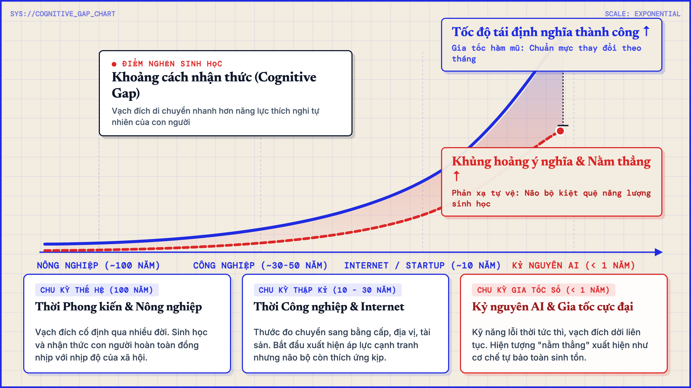

# Khủng hoảng định nghĩa thành công: Khi vạch đích liên tục bị dời đi

Nỗi hoang mang lớn nhất của một người trẻ hôm nay không phải là việc họ thiếu năng lực hay không đủ chăm chỉ, mà là cảm giác chiếc vé họ vừa đổi bằng gần một thập kỷ thanh xuân bỗng bị tuyên bố là hết hạn sử dụng.

Năm 18 tuổi, bạn bước vào cánh cổng đại học với một định nghĩa thành công được cả xã hội công nhận là chân lý. Bạn dốc trọn 4 năm giảng đường cày cuốc, thi cử, thức khuya dậy sớm. Ra trường, bạn tiếp tục dành thêm 4 hay 5 năm đầu đời bạt mạng làm việc ngoài thương trường, chấp nhận làm thêm giờ, hy sinh giấc ngủ và gác lại những sở thích riêng tư để leo lên những nấc thang đầu tiên.

Bạn dốc cạn gần mười năm thanh xuân tươi đẹp nhất chỉ vì một lời hứa: chỉ cần đạt được cột mốc đó, cuộc đời bạn sẽ ổn định và có giá trị.

Thế nhưng điều tàn nhẫn là, ngay khi bạn vừa kiệt sức chạm được tay vào mục tiêu ấy, thế giới bỗng nhiên đổi luật chơi.

Định nghĩa thành công mà bạn dành cả tuổi trẻ để theo đuổi bỗng chốc trở nên lỗi thời. Ngành nghề từng là niềm tự hào của bạn bỗng bị bão hòa, hoặc bị các công cụ công nghệ mới làm thay trong tích tắc với chi phí gần như bằng không. Tấm bằng đại học và những kỹ năng bạn nhọc nhằn tích lũy giờ đây không còn đảm bảo cho bất kỳ sự an toàn nào. Toàn bộ mục tiêu mà bạn đặt trọn niềm tin từ năm 18 tuổi bỗng nhiên trở nên vô nghĩa.

## Khi chu kỳ thành công ngắn hơn thời gian rèn luyện

Điểm khác biệt chí mạng của thời đại hôm nay nằm ở tốc độ thay đổi.

Trước đây, một định nghĩa về thành công có thể đứng vững suốt vài thế hệ. Một lộ trình quen thuộc từ việc học tập, có một công việc ổn định, tích lũy tài sản cho đến an hưởng tuổi già có thể truyền từ đời ông bà sang cha mẹ rồi con cái mà ít khi sai lệch. Nhịp thích nghi sinh học của con người hoàn toàn đồng điệu với tốc độ phát triển của xã hội.

Thế nhưng làn sóng công nghệ gia tốc hôm nay đã vặn chiếc đồng hồ văn minh chạy nhanh đến mức chóng mặt.

Chỉ trong một thời gian ngắn ngủi, những khái niệm nền tảng nhất liên tục bị xới tung và viết lại:
Lao động là gì khi trí tuệ nhân tạo có thể viết mã, thiết kế hình ảnh, phân tích dữ liệu và soạn thảo văn bản trong vài giây?
Nghề nghiệp ổn định là gì khi một lĩnh vực đang ở đỉnh cao hôm nay có thể bị thu hẹp chỉ sau một đợt tái cấu trúc quy mô lớn?
Tri thức là gì khi việc ghi nhớ và tư duy logic căn bản không còn là đặc quyền riêng của con người?

Khi những cột trụ cơ bản nhất đã lung lay, thước đo của sự thành công cũng bị cuốn vào vòng xoáy tái định nghĩa liên tục.

Và đây chính là bi kịch nhận thức sâu sắc nhất: chu kỳ tồn tại của một định nghĩa thành công giờ đây ngắn hơn cả thời gian cần thiết để một người kịp theo đuổi và làm chủ nó. Vạch đích liên tục bị dời đi trong khi người chạy vẫn chưa kịp lấy lại hơi thở.

## Cơn khủng hoảng ý nghĩa và tiếng thở dài nằm thẳng

Sự hụt hẫng này tàn khốc hơn rất nhiều so với một thất bại thông thường trong công việc.

Nếu bạn thất bại trong một trò chơi mà luật chơi vẫn còn giá trị, bạn vẫn có thể cắn răng đứng dậy để rèn luyện và làm lại từ đầu. Nhưng điều tàn nhẫn ở đây là chính cái trò chơi mà bạn vừa dành trọn tuổi trẻ để tham gia đã bị tuyên bố là vô giá trị.

Đó là lúc cuộc khủng hoảng ý nghĩa thực sự trồi lên, bóp nghẹt tâm trí: Nếu mọi thứ mình dốc sức tích lũy suốt gần mười năm qua có thể trở thành số không chỉ sau một đêm, thì việc tiếp tục lao vào cuộc đua tiếp theo có ý nghĩa gì? Mình đang sống cho một cuộc đời đích thực, hay chỉ đang biến thanh xuân của mình thành nhiên liệu tiêu hao cho những chiếc bánh vẽ ngắn hạn của thị trường?

Làn sóng nằm thẳng (tang ping) ở châu Á hay trào lưu giảm bớt cam kết trong công việc (quiet quitting) ở phương Tây không phải là biểu hiện của sự lười biếng hay buông xuôi vô cớ.

Nhìn dưới góc độ sinh học và tâm lý học, nằm thẳng chính là một phản xạ tự vệ sinh tồn. Đó là phản ứng tự nhiên của một bộ não sau khi nhận ra sự thật cay đắng: nếu chiếc vé đổi bằng 10 năm thanh xuân đã bị vô hiệu hóa, thì việc tiếp tục bán mạng cho một chiếc vé khác cũng sẽ hết hạn sau vài năm chỉ là một hành vi tự hủy hoại bản thân. Cơ thể và tâm trí buộc phải chọn cách dừng lại để tự bảo toàn năng lượng sống.

## Buông bỏ những bản hợp đồng vay mượn

Bản chất của việc chạy theo các định nghĩa thành công từ bên ngoài giống như việc ký vào một bản hợp đồng vay mượn với mức lãi suất thả nổi. Ở đó, toàn bộ sự tự tôn và giá trị sống của ta bị đem ra thế chấp cho các chu kỳ kinh tế, cho thuật toán truyền thông và cho ánh nhìn của người khác. Mà những thứ ấy thì chưa từng cam kết sẽ đứng yên để chờ đợi chúng ta.

Trong một thời đại mà công nghệ biến đổi theo từng tuần, việc cố gắng đi tìm một định nghĩa thành công mới để tiếp tục chạy theo chỉ là hành động đổi từ chiếc lồng son này sang một chiếc lồng son khác.

Có lẽ đã đến lúc con người cần can đảm buông bỏ nhu cầu đi tìm một định nghĩa cố định cho hai chữ thành công. Chỗ dựa an toàn nhất lúc này không nằm ở các thước đo bên ngoài, mà nằm ở hai nguyên tắc căn bản bên trong: trí tuệ và lòng từ bi.

Trí tuệ trước hết là sự sáng suốt để nhìn rõ tính vô thường của mọi khuôn mẫu xã hội. Khi hiểu rằng mọi chức danh, mọi ngành nghề thời thượng hay những bảng danh sách vinh danh hào nhoáng đều chỉ là những hiện tượng tạm bợ của từng thời kỳ, ta sẽ không còn ngây thơ đánh đổi toàn bộ danh dự và lẽ sống của mình cho chúng. Trí tuệ giúp ta phân định rõ giữa công cụ và cứu cánh: công nghệ hay tiền bạc chỉ là phương tiện phục vụ sự sống, chứ không bao giờ được phép biến sự sống thành nô lệ của chúng.

Đi cùng với trí tuệ là lòng từ bi, bắt đầu từ sự trắc ẩn với chính bản thân mình. Đó là sự tha thứ cho chính mình vì đã từng ngây thơ tin vào những lời hứa hẹn vay mượn. Đó là dũng khí cho phép mình được nghỉ ngơi, được thở, được từ chối việc tham gia vào những cuộc đua độc hại mà không cảm thấy mình là kẻ thất bại. Khi có lòng trắc ẩn với chính mình, ta cũng sẽ nhìn những người xung quanh với ánh mắt thấu hiểu thay vì phán xét, nhìn họ như những người bạn cùng thời đang chia sẻ chung một nỗi âu lo thế hệ.

## Để mỗi người tự làm chủ cuộc đời mình

Khi một người đã có đủ sự tỉnh táo và lòng trắc ẩn, họ không còn nhu cầu đi tìm thêm một định nghĩa thành công nào từ xã hội. Họ hiểu rằng việc tiếp tục đóng khung hai chữ thành công chỉ là hành vi tự xây thêm một chiếc lồng son mới.

Thay vì đi tìm một mẫu số chung cho nhân thế, họ tập trung nuôi dưỡng hai năng lực cốt lõi:
Trí tuệ giúp họ phân biệt rạch ròi giữa phương tiện và mục đích sống, nhận diện các bẫy tâm lý của thị trường để không bị cuốn trôi.
Từ bi giúp họ hòa giải với chính mình, dừng việc tự bạo lực nhận thức và mở rộng sự thấu cảm tới tha nhân.

Từ nền tảng của trí tuệ và từ bi, mỗi người sẽ tự có quyền năng và sự tự do để định nghĩa cuộc đời của riêng họ. 

Không ai có quyền áp đặt thành công lên bạn, và bạn cũng không cần một chiếc cúp nào bảo lãnh cho sự tồn tại của mình. Bạn không cần trốn chạy bằng cách nằm thẳng, cũng không cần vắt kiệt thanh xuân để đuổi theo những vạch đích di động. Bạn sống an nhiên giữa đời, và tự tay quyết định giá trị cho từng ngày được thở và hiện diện.
