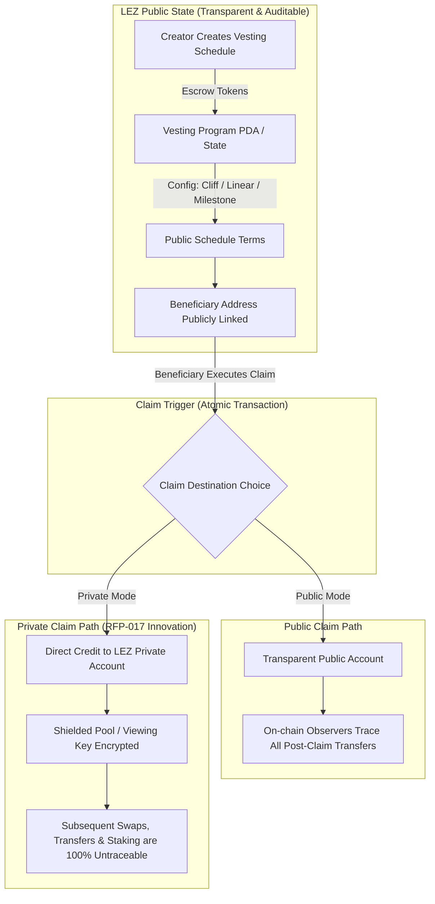

# Logos RFP-017: Privacy-Preserving Token Vesting — Master Research & Brief

> **Target Directory:** `/topics/logos-rfp-017`  
> **Source Spec:** [`logos-co/rfp/RFPs/RFP-017-token-vesting.md`](https://github.com/logos-co/rfp/blob/master/RFPs/RFP-017-token-vesting.md)  
> **Category:** Applications & Integrations | **Tier:** Large (L) | **Status:** Open  
> **Estimated Timeline:** 10–12 Weeks | **License:** MIT + Apache 2.0 Dual License

---

## 🗂️ Folder Structure & Navigation

This topic directory is organized into three dedicated modules for easy navigation:

```
topics/logos-rfp-017/
├── README.md                                  # [Current File] Master Directory & Overview
│
├── 📁 1-pager/                                # Executive 1-Pager & Visuals
│   ├── index.html                             # Visual HTML 1-Pager (Dark mode, glassmorphism, responsive)
│   ├── preview.png                            # Full-page rendered screenshot
│   └── one-pager-rfp-017.md                   # Markdown executive summary
│
├── 📁 research/                               # In-Depth Research & Technical Blueprints
│   ├── 01-rfp-017-specification-deep-dive.md  # Detailed requirements, lifecycle & dependencies
│   ├── 02-privacy-mechanisms-lez-architecture.md # LEZ zkVM internals, SPEL & shielded accounts
│   ├── 03-competitive-landscape-market-analysis.md # Competitor benchmark ($60B Magna/Kraken M&A)
│   └── 04-technical-implementation-blueprint.md   # Program architecture, SDK & Mini-App specs
│
└── 📁 ref-specs/                              # Upstream Reference Specifications
    ├── RFP-017-token-vesting-raw.md           # Raw upstream RFP-017 markdown
    ├── token-vesting-ecosystem-raw.md         # Upstream ecosystem survey appendix
    ├── LP-0012.md                             # Event/Log mechanism for LEZ (Resolved)
    ├── LP-0013.md                             # Token mint/transfer authorities (Open Blocker)
    ├── LP-0015.md                             # General cross-program tail calls (Resolved)
    ├── RFP-001-reference.md                   # Admin authority library specification
    └── RFP-008-reference.md                   # Lending & borrowing public/private pattern
```

---

## 🧭 Executive Summary of Findings



### 1. The Multi-Billion Dollar Opportunity
* **Massive Captive Market:** Over **$97.43B in token unlocks** occurred in 2025 alone (*Tokenomist*). Every token launched on the Logos ecosystem must escrow tokens via vesting.
* **M&A & Buyout Precedent:** In February 2026, **Payward (Kraken)** acquired enterprise vesting leader **Magna** after it achieved **$60B in peak TVL**, validating token vesting infrastructure as an indispensable institutional asset.
* **The 100% Privacy Vacuum:** Across 10 incumbent protocols surveyed (**Magna, Sablier, Streamflow, Hedgey, Jupiter Lock**), **zero competitors offer privacy**. Building on LEZ creates an uncontested monopoly on high-net-worth founders, VC funds, and institutional whales who refuse to have their unlock dates front-run.

### 2. Core Architectural Model
* **Public Macro-State vs Private Micro-Settlement:** The macro parameters (total token lock, cliff date, linear duration, beneficiary pubkey) remain publicly auditable on-chain. When claimed, tokens are credited straight into an encrypted **shielded private account**, preventing MEV front-running and wallet clustering.
* **Three Schedule Types:** Cliff + Linear (Teams/VCs), Fully Linear (Advisors/Grants), and Milestone-Based (Qualitative deliverable tranches).
* **Universal Revocation Invariant:** Already-vested tokens remain 100% claimable forever; unvested tokens return to the creator upon cancellation.

### 3. Logos Ecosystem Support Package
* **Grant Funding:** Tier Large (L) non-dilutive milestone-based grant.
* **Developer Tools:** SPEL framework (`#[lez_program]` macros, IDL generator, typed Rust/TS client generator).
* **Distribution:** Pre-built distribution into the **Logos Basecamp** Desktop Store and standard integration across all LEZ Launchpads ([RFP-015](ref-specs/RFP-015-bonding-curve-launchpad.md)/[RFP-016](ref-specs/RFP-016-lbp-launchpad.md)).

---

## 🔗 Quick Navigation Links

* 📊 **1-Pager Briefs:**
  - [Visual HTML 1-Pager](1-pager/index.html)
  - [Executive Markdown 1-Pager](1-pager/one-pager-rfp-017.md)
  - [Rendered Preview PNG](1-pager/preview.png)
* 🔬 **Research Deep-Dives:**
  - [01. Specification Deep-Dive](research/01-rfp-017-specification-deep-dive.md)
  - [02. Privacy & LEZ Architecture](research/02-privacy-mechanisms-lez-architecture.md)
  - [03. Competitive Landscape & M&A Benchmark](research/03-competitive-landscape-market-analysis.md)
  - [04. Technical Implementation Blueprint](research/04-technical-implementation-blueprint.md)
* 📄 **Upstream Reference Documents:**
  - [RFP-017 Full Raw Specification](ref-specs/RFP-017-token-vesting-raw.md)
  - [Token Vesting Ecosystem Survey](ref-specs/token-vesting-ecosystem-raw.md)
