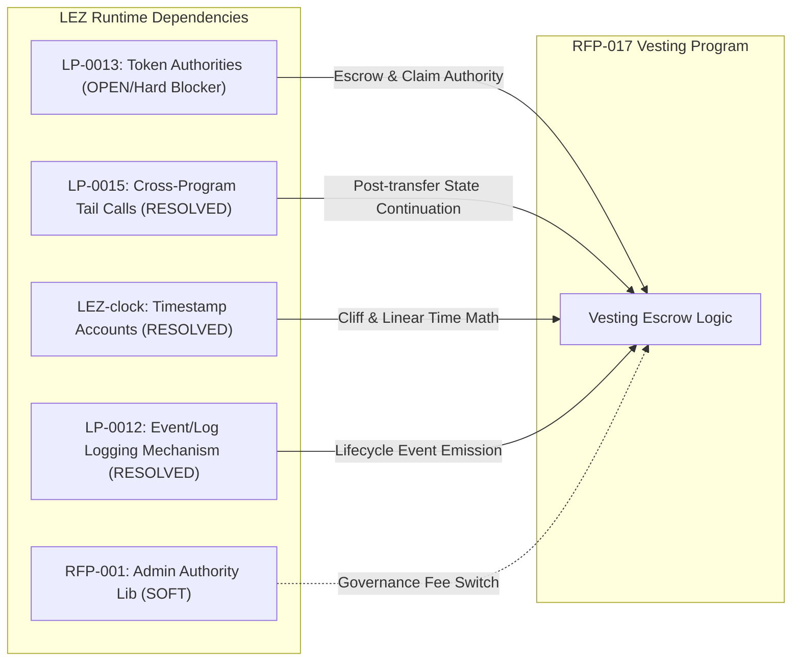

# RFP-017 Specification Deep-Dive

> **Document:** `01-rfp-017-specification-deep-dive.md`  
> **Source:** Logos RFP-017 (`logos-co/rfp`)  
> **Category:** Applications & Integrations | **Target Runtime:** LEZ (Logos Execution Zone)

---

## 1. Overview & Context

Token vesting is non-negotiable for token launches. When a protocol launches, tokens must be locked for founders, seed/private investors, advisors, liquidity pools, and ecosystem reserves.

On transparent blockchains (EVM, Solana), vesting contracts operate as public surveillance trackers. Analytics aggregators (such as Tokenomist) monitor every unlock event across $97B+ of allocations. Traders anticipate large unlock dates and front-run them, driving market volatility.

**RFP-017** specifies the creation of a privacy-preserving token vesting program on **LEZ (Logos Execution Zone)** that allows recipients to claim vested tokens directly into shielded private accounts.

---

## 2. Hard Requirements Matrix

### A. Core Functionality

| Feature | Requirement & Specification | Architectural Rationale |
| :--- | :--- | :--- |
| **Schedule Types** | Support three distinct schedule modes: 1. **Cliff + Linear**: Lump-sum unlock at cliff timestamp, followed by linear per-unit-time accrual. 2. **Fully Linear**: Continuous accrual from timestamp zero (no cliff). 3. **Milestone-Based**: Discrete tranches released via explicit creator signals. | Covers 100% of real-world vesting relationships (team/VC locks, ongoing contributors, and deliverable-based grants). |
| **Dual Claim Targets** | Claiming supported to **Public Accounts** and **Private (Shielded) Accounts**. Creator never learns the private address. | Allows users to opt for complete post-claim confidentiality. |
| **Cancellation Semantics** | Configured at creation (defaults to `cancelable`). One-way upgrade to `non-cancelable` permitted (irreversible). **Earned invariant**: Vested tokens remain claimable; unvested tokens return to creator. | Protects contributors' earned compensation while allowing projects to reclaim unearned future allocations upon contract termination. |
| **Position Transferability** | Configurable at creation (`transferable = true/false`), frozen permanently thereafter. | Allows personal employment locks (non-transferable) vs. investor secondary market assignments (transferable). |
| **Batch Creation** | Multi-recipient batch initialization in a single transaction up to LEZ transaction size limits. | Critical for TGE multi-recipient allocations (co-founders, advisors, investor tranches) to save gas. |
| **Event Emission** | Emit LEZ logs (`LP-0012`) on every lifecycle transition: Creation, Claim, Cancellation, Milestone Signal, Beneficiary Transfer. | Enables indexers, Basecamp notifications, and portfolio tracking. |

---

### B. Usability & Deliverables

1. **Logos Module SDK:**
   - Full lifecycle coverage in Rust / TypeScript: `create_schedule`, `query_claimable_amount`, `claim` (public & private), `cancel`, `signal_milestone`, `transfer_beneficiary`.
   - Private target account validation prior to dispatch.
2. **Logos Basecamp Mini-App (GUI):**
   - **Recipient View:** Position metrics, total locked, claimable balance now, next unlock event countdown, one-click claim.
   - **Creator View:** Schedule wizard (multi-recipient CSV/batch, cliff/duration/milestones), active schedule manager, milestone trigger, revocation control.
   - **Pre-Claim Confirmation Modal:** Estimated transaction fee, gas balance sufficiency check for private accounts, and **Privacy Disclosure**.
3. **Standalone CLI:**
   - Complete terminal tool for headless server management, scripted multisig actions, and developer testing.
4. **SPEL IDL:**
   - Full Interface Definition Language specification using the [SPEL Framework](https://github.com/logos-co/spel).
5. **Actionable Error Reporting:**
   - Deterministic error codes for locked periods, zero claimable balances (with exact timestamp of next unlock), unauthorized cancellations, and double-signalling.

---

### C. Reliability & Safety Guarantees

* **Atomic Claims:** A claim either transfers tokens and updates state atomically, or completely reverts without gas token leakage or state corruption.
* **Atomic Cancellation:** Reclaims unvested tokens and locks remaining unvested accrual in a single state transition.
* **Idempotent Milestone Signalling:** Signalling an already-completed milestone index is rejected with a deterministic error code, preventing double-minting / double-unlocking exploits.
* **Concurrency Safety:** Independent claims across disparate schedules execute concurrently without state collisions.

---

### D. Performance Benchmarks

* **Single-Transaction Claims:** Every claim must complete within a single LEZ transaction execution.
* **Compute Unit (CU) Accounting:** Deliver detailed CU measurement tables across all instructions for LEZ Testnet 0.2, Testnet 0.3, and Mainnet.

---

## 3. Platform Dependencies Analysis

### 1. LP-0013: Token Authorities (Hard Dependency - In Progress)
- **Role:** The vesting contract acts as a custodial escrow. It requires the LEZ token transfer-authority primitives to hold tokens during the lockup period and transfer them to beneficiaries upon valid claim invocations.
- **Status:** Open Lambda Prize.

### 2. LP-0015: General Cross-Program Tail Calls (Resolved)
- **Role:** Enables the vesting program to initiate a token transfer via CPI (cross-program invocation) to the token program and execute schedule state updates in a protected continuation.
- **Status:** Closed / Delivered in core LEZ runtime.

### 3. LEZ-Clock: On-Chain Timestamp Account (Resolved)
- **Role:** Time-based linear accrual and cliff checking require reliable on-chain clock accounts accessible within zkVM execution.
- **Status:** Closed / Delivered.

### 4. LP-0012: Event/Log Emission Mechanism (Resolved)
- **Role:** Emits structured execution logs for indexers and Basecamp UI notifications.
- **Status:** Closed / Delivered.

---

## 4. Milestone Schedule & Verification Gates

The RFP requires a three-phase deployment and testing roadmap:

1. **Milestone 1 — LEZ Testnet 0.2 Deployment & Local CI:**
   - Deploy smart contract on LEZ Testnet 0.2.
   - Comprehensive unit and integration test suite running against standalone LEZ Sequencer in CI.
   - Verification of `RISC0_DEV_MODE=0` zkVM proof generation.
2. **Milestone 2 — Mini-App GUI, CLI & Testnet 0.3 Verification:**
   - Complete Logos Basecamp Mini-App integration.
   - Functional CLI and SPEL IDL generation.
   - Migration and compatibility testing on LEZ Testnet 0.3.
3. **Milestone 3 — LEZ Mainnet Deployment & Audit Readiness:**
   - Production deployment to LEZ Mainnet.
   - Full documentation, CU benchmark tables, and open-source release under MIT + Apache 2.0 dual license.
