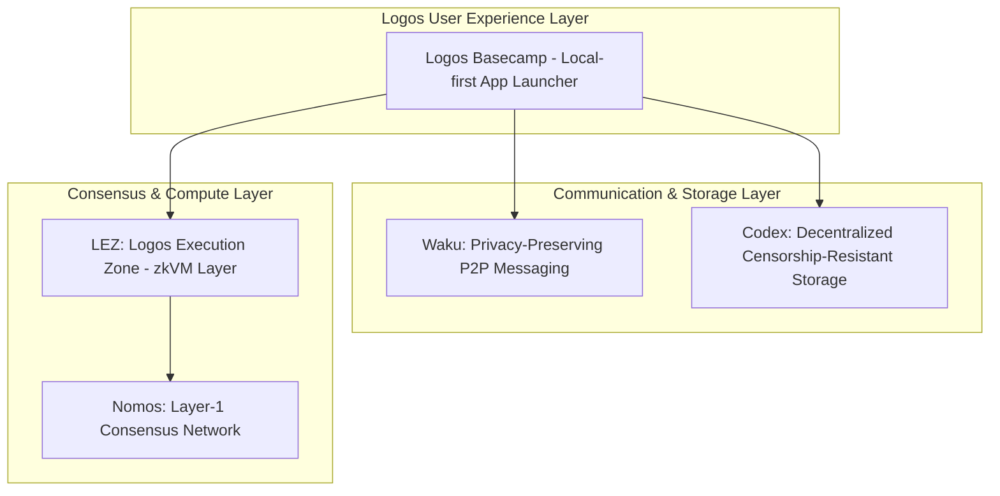
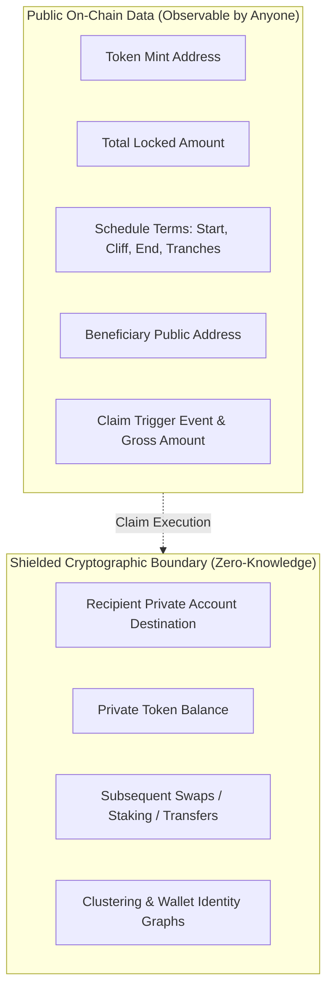
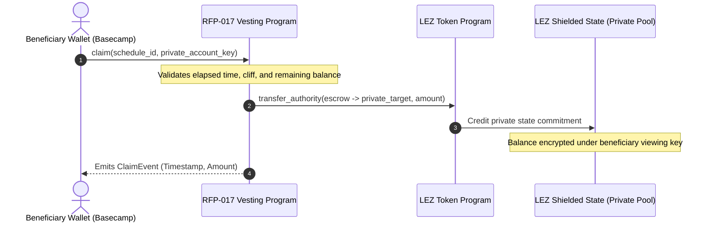

# Privacy Architecture & LEZ Execution Zone Mechanics

> **Document:** `02-privacy-mechanisms-lez-architecture.md`  
> **Topic:** Technical Privacy Mechanisms, Zero-Knowledge Runtime, and Adversarial Threat Mitigation

---

## 1. The Logos Architecture: Foundational Stack

Logos is designed as a sovereign, privacy-preserving, censorship-resistant technology stack composed of four modular layers:

### What is LEZ (Logos Execution Zone)?
* **zkVM Execution:** LEZ is a programmable layer built on top of **RISC Zero zkVM**. All program executions produce succinct cryptographic zero-knowledge proofs of computational integrity.
* **Dual-State System:** LEZ supports both transparent public accounts and shielded private accounts natively within the same execution environment.
* **SPEL Framework:** An Anchor-inspired declarative Rust framework providing `#[lez_program]` macros, automatic IDL generation, client SDK bindings (`spel-client-gen`), and registry cataloging (`spelbook`).

---

## 2. Privacy vs Transparency: Architectural Boundaries

A critical design choice in RFP-017 is balancing **ecosystem transparency (macro-level auditability)** with **beneficiary confidentiality (micro-level execution privacy)**.

### What is Public on LEZ:
1. **Schedule Invariant:** Token mint, total allocation, cliff date, end date, and milestone tranches.
2. **Beneficiary Identifier:** The public address designated to authorize claims.
3. **Execution Timestamp & Claim Size:** The exact number of tokens claimed at a specific timestamp.

### What is Private on LEZ:
1. **Destination Shielded Account:** The exact private balance credited during the claim.
2. **Post-Claim Token Flow:** All downstream transactions (transfers to other private addresses, shielded DeFi interactions, private swaps) are untraceable.
3. **Identity Clustering:** Block analytics bots cannot map the beneficiary's cold storage or active operational wallets to the vesting contract.

---

## 3. Claim Mechanics: Direct Private State Credit

On traditional chains (Ethereum, Solana), transferring tokens requires specifying a public recipient address that updates a transparent on-chain ledger.

### The LEZ Innovation:
In LEZ, programs possess the primitive capability to **increase the balance of foreign private accounts directly** without routing tokens through an intermediate public account:

1. **Beneficiary Invokes Claim:** The beneficiary submits a claim transaction signed with their authorized key, supplying their private account address.
2. **Escrow Transfer:** The vesting program invokes the Token Program via cross-program call (`LP-0015`).
3. **Direct Shielding:** The tokens are transferred out of public escrow and committed directly to the recipient's shielded balance in the LEZ Private State.
4. **Zero Linkability:** The creator and third-party observers see that `X` tokens were claimed from Schedule `Y`, but no observer can identify which private account now holds those assets.

---

## 4. Threat Model & Adversarial Dynamics Mitigated

### Threat 1: Adversarial Front-Running of Unlock Calendars
* **The Vulnerability:** Public analytics platforms (Tokenomist, CoinGecko, DeFiLlama) index upcoming token unlocks. When a large team or investor unlock approaches, predatory traders open massive short positions, front-running the recipient's liquidity.
* **Real-World Case Study:** In April 2025, the MANTRA ($OM) token suffered a **90% market collapse in hours** (crashing from over $6.00 to under $0.50 and wiping >$5B in market cap) triggered by panic and forced liquidations surrounding perceived transparent unlock events.
* **LEZ Mitigation:** Because claimed tokens enter a private account, the market cannot determine whether the recipient held, staked, or OTC-transferred their tokens, eliminating predictable sell-pressure front-running.

### Threat 2: Social Engineering & Recipient Doxxing
* **The Vulnerability:** High-profile contributors, founders, and seed investors with known public addresses are constantly targeted for phishing, targeted malware, and physical coercion once their multi-million dollar vesting claims are broadcast on-chain.
* **LEZ Mitigation:** Post-claim privacy ensures that asset accumulation remains confidential to the viewing key holder.

---

## 5. Privacy UX Requirements & Disclosure Standard

To prevent user error and maintain legal/compliance clarity, the Logos Basecamp Mini-App and SDK enforce strict pre-claim safeguards:

1. **Pre-Claim Privacy Disclosure:**
   Before approving a private claim, the GUI renders a modal explaining:
   > *"You are claiming **50,000 TOKENS** to a Private Account.*  
   > *• **Visible On-Chain:** Claim Amount (50,000), Vesting Address, and Beneficiary Public Key.*  
   > *• **Shielded & Private:** Destination Private Account and all future transfers or trades."*
2. **Gas Account Sufficiency Check:**
   The SDK verifies that the claimant account holds sufficient unshielded gas tokens to execute the zero-knowledge proof generation and state transition, presenting an actionable error if gas is deficient.
3. **Target Validation:**
   The SDK cryptographically checks whether the target is a valid LEZ shielded account before submitting the transaction.

---

## 6. Future Privacy Evolution: LP-0003 & Full Anonymity

### Current Boundary:
In RFP-017, the beneficiary's public address is associated with the schedule at creation time. Observers know *who* earned the right to claim and *when* they claimed, even though they cannot trace *where* the tokens went afterwards.

### Future Upgrade (Commitment-Based Registration):
Future iterations will incorporate **LP-0003** (Shielded Allow-lists & Merkle Tree Commitments):
* Creators will initialize schedules using a **Merkle root of beneficiary commitments** (hashes of secret viewing keys).
* Beneficiaries will claim using zero-knowledge membership proofs without ever revealing their public address.
* This will achieve **100% End-to-End Anonymity** (complete decoupling of creator, beneficiary, schedule, and claimed assets).
