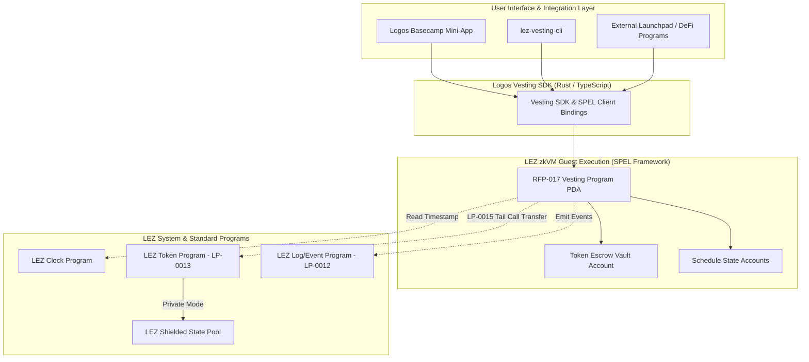

# Technical Implementation Blueprint: RFP-017 Vesting Program

> **Document:** `04-technical-implementation-blueprint.md`  
> **Topic:** Smart Contract Architecture, SPEL Program Layout, SDK/CLI Interfaces, and Basecamp Mini-App

---

## 1. System Architecture Overview

The RFP-017 implementation consists of four primary components:
1. **Core LEZ Program (`lez-vesting`):** The guest zkVM program compiled for RISC Zero using the SPEL framework.
2. **Client SDK (`@logos-lez/vesting-sdk` / `lez_vesting_sdk`):** High-level client libraries in Rust and TypeScript.
3. **Logos Basecamp Mini-App:** A local-first Web/React mini-app loadable in the Logos ecosystem.
4. **Command-Line Interface (`lez-vesting-cli`):** Automated CLI tool for administrative and CI operations.



---

## 2. On-Chain State & Account Schemas (Rust / SPEL)

```rust
use spel::prelude::*;

/// Main Vesting Schedule State Account
#[account]
#[derive(Default, Debug)]
pub struct VestingSchedule {
    pub schedule_id: [u8; 32],
    pub creator: Pubkey,
    pub beneficiary: Pubkey,
    pub token_mint: Pubkey,
    pub escrow_vault: Pubkey,
    
    // Financial Amounts
    pub total_amount: u64,
    pub claimed_amount: u64,
    
    // Configuration & Flags
    pub schedule_type: ScheduleType,
    pub is_cancelable: bool,
    pub is_transferable: bool,
    pub is_cancelled: bool,
    
    // Dedicated Authorities
    pub cancellation_authority: Option<Pubkey>,
    pub milestone_authority: Option<Pubkey>,
    
    // State Tracking
    pub created_at: u64,
    pub last_claimed_at: u64,
}

#[derive(AnchorSerialize, AnchorDeserialize, Clone, PartialEq, Eq, Debug)]
pub enum ScheduleType {
    CliffLinear {
        start_time: u64,
        cliff_time: u64,
        end_time: u64,
        cliff_amount: u64,
    },
    FullyLinear {
        start_time: u64,
        end_time: u64,
    },
    Milestone {
        tranches: Vec<MilestoneTranche>,
    },
}

#[derive(AnchorSerialize, AnchorDeserialize, Clone, PartialEq, Eq, Debug)]
pub struct MilestoneTranche {
    pub index: u8,
    pub amount: u64,
    pub is_completed: bool,
    pub completed_at: Option<u64>,
}
```

---

## 3. Core Program Instruction Interface

| Instruction | Signer | Key Parameters | State Transition & Checks |
| :--- | :--- | :--- | :--- |
| `create_schedule` | Creator | `beneficiary`, `mint`, `amount`, `schedule_type`, `cancelable`, `transferable` | Escrows `total_amount` from creator. Initializes `VestingSchedule` state. Emits `ScheduleCreatedEvent`. |
| `batch_create` | Creator | `Vec<ScheduleParams>` (up to tx CU limit) | Iterates over tranches, transfers aggregate tokens, and initializes multiple schedule PDAs. |
| `claim_public` | Beneficiary | `schedule_id`, `amount_to_claim` | Computes claimable delta. Transfers tokens from escrow vault to beneficiary's public token account. |
| `claim_private` | Beneficiary | `schedule_id`, `shielded_account_id` | Computes claimable delta. Directs Token Program to credit tokens into the shielded state commitment. |
| `cancel_schedule`| Creator / Authority | `schedule_id` | Asserts `is_cancelable == true`. Computes vested vs unvested tokens. Refunds unvested tokens to creator. |
| `signal_milestone`| Creator / Authority | `schedule_id`, `milestone_index` | Asserts milestone not already signaled (idempotent). Unlocks tranche amount. Emits `MilestoneSignaledEvent`. |
| `transfer_beneficiary`| Beneficiary | `schedule_id`, `new_beneficiary` | Asserts `is_transferable == true`. Updates beneficiary pubkey. Emits `BeneficiaryTransferredEvent`. |
| `set_non_cancelable`| Creator | `schedule_id` | Permanently sets `is_cancelable = false`. Irreversible one-way transition. |

---

## 4. Mathematical Accrual Logic

### Cliff + Linear Accrual:
$$\text{Claimable}(t) = \begin{cases} 
0 & t < t_{\text{cliff}} \\
A_{\text{cliff}} + (A_{\text{total}} - A_{\text{cliff}}) \times \frac{t - t_{\text{cliff}}}{t_{\text{end}} - t_{\text{cliff}}} - A_{\text{claimed}} & t_{\text{cliff}} \le t < t_{\text{end}} \\
A_{\text{total}} - A_{\text{claimed}} & t \ge t_{\text{end}}
\end{cases}$$

### Milestone Accrual:
$$\text{Claimable}(t) = \sum_{i \in \text{Completed}} A_{\text{tranche}}[i] - A_{\text{claimed}}$$

---

## 5. Logos Basecamp Mini-App: UI/UX Specification

### Component Hierarchy:
```
BasecampVestingApp/
├── NavigationBar (Wallet Connect, Mode Switch, Network Status)
├── RecipientDashboard
│   ├── ActivePositionCard (Total Locked, Token Icon, Progress Bar)
│   ├── ClaimMetrics (Claimable Now, Next Unlock Countdown)
│   ├── ClaimControlPanel
│   │   ├── Toggle: [ Public Account | Shielded Private Account ]
│   │   └── ActionButton: [ Claim Vested Tokens ]
│   └── PreClaimModal
│       ├── Gas Sufficiency Check Indicator
│       ├── Fee Breakdown
│       └── Privacy Disclosure Card
└── CreatorDashboard
    ├── ScheduleCreationWizard (Single / CSV Multi-Recipient Upload)
    ├── ScheduleManagerTable (Active Schedules, Filter by Token/Beneficiary)
    ├── MilestoneSignalingModal
    └── CancellationManagementModal
```

### Privacy Disclosure Component Standard:
```tsx
export const PrivacyDisclosureModal = ({ amount, tokenSymbol, isPrivate, onConfirm }) => (
  <Modal title="Confirm Token Claim">
    <div className="summary-box">
      <p>Amount to Claim: <strong>{amount} {tokenSymbol}</strong></p>
      <p>Destination Mode: <Badge variant={isPrivate ? "shielded" : "public"}>{isPrivate ? "Shielded Private Account" : "Public Account"}</Badge></p>
    </div>
    
    {isPrivate && (
      <div className="privacy-alert">
        <h4>🔒 On-Chain Privacy Guarantee</h4>
        <ul>
          <li><strong>Publicly Observable:</strong> Claim event timestamp, amount ({amount}), and schedule address.</li>
          <li><strong>Cryptographically Shielded:</strong> Your private account destination and all subsequent token movements cannot be linked or traced on-chain.</li>
        </ul>
      </div>
    )}
    
    <Button onClick={onConfirm} variant="primary">Authorize & Submit Claim</Button>
  </Modal>
);
```

---

## 6. Testing, CI/CD & Verification Protocol

1. **Standalone Sequencer Integration:**
   - Execute test suites against a local LEZ Sequencer binary with full proof generation enabled (`RISC0_DEV_MODE=0`).
2. **CI Pipeline Gates:**
   - Automated GitHub Actions workflow executing unit tests, property-based tests (Proptest) for accrual edge cases, and SPEL IDL validation.
3. **Compute Unit (CU) Budget Profiling:**
   - Record exact CU usage for each instruction across Testnet 0.2 and 0.3 to prevent out-of-gas failures during multi-recipient batch transactions.
