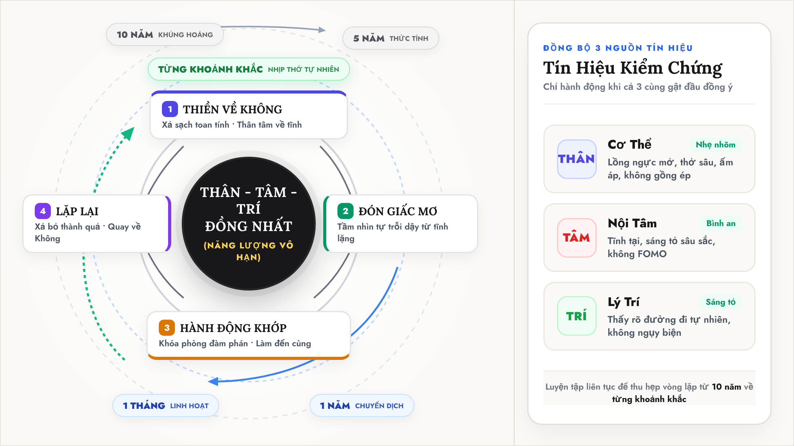

# Lý Trí Luôn Đưa Ra Quyết Định Vô Nghĩa

Năm năm qua, tôi đã sống đúng như cách mà một người làm kỹ thuật được dạy để sống: luôn duy lý.

Trước mỗi ngã rẽ hay dự án mới, phản xạ đầu tiên của tôi luôn là mở máy tính, lập bảng cân nhắc, liệt kê ưu nhược điểm, tính toán thiệt hơn và chọn phương án an toàn nhất. Những quyết định ấy luôn chuẩn xác trên giấy tờ. Chúng hợp lý đến mức không ai có thể bắt bẻ.

Nhưng sau nửa thập kỷ nhìn lại, cái giá tôi phải trả là một sự thật cay đắng:

**Mọi quyết định duy lý tính tôi từng đưa ra đều dẫn tôi đến cùng một cảm giác: cuộc sống trở nên vô nghĩa, và cơ thể rơi vào trạng thái cạn kiệt năng lượng kéo dài.**

Cứ sau mỗi mục tiêu hoàn thành, thay vì cảm thấy trọn vẹn, tôi chỉ thấy một khoảng trống hoác. Để chạm tới những cái đích do lý trí vẽ ra, tôi phải liên tục ép mình. Tôi gồng gánh bằng nghị lực, nén chặt sự mệt mỏi của cơ thể và phớt lờ những hoài nghi trong lòng. Tôi tự biến mình thành một cỗ máy cày cuốc, đốt sạch từng chút sinh lực cho những thứ mà sâu thẳm bên trong, tôi chưa từng thực sự rung động.

Sau 5 năm tự vắt kiệt mình, tôi mới hiểu ra: cái đầu con người thực ra rất tệ trong việc đưa ra một quyết định sống.

---

## Cái đầu bị quyết định trên sự thiếu thông tin

Tại sao một quyết định nghe rất thông minh lại có thể rút cạn sức sống của tôi?

Bởi vì tôi từng lầm tưởng rằng mình đã có "đầy đủ thông tin" khi đã gom đủ số liệu và lập luận chặt chẽ. Nhưng thực tế, cái đầu chỉ là một bộ xử lý logic. Nó ra quyết định trong sự mù quáng vì thiếu hẳn hai nguồn dữ liệu quan trọng nhất: thân thể và con tim.

Trước hết, **nó hoàn toàn mù thông tin sinh học từ thân thể**.  
Cơ thể lưu giữ hàng triệu năm thích nghi và tiến hóa. Khi đứng trước một lựa chọn sai, cơ thể tôi luôn lên tiếng trước: một sự thắt lại ở bụng, lồng ngực hơi nghẹn, hơi thở nông, vai gáy bắt đầu căng cứng. Nhưng cái đầu duy lý lại xem thường những tín hiệu ấy. Nó coi đó chỉ là sự lười biếng hoặc mệt mỏi nhất thời, rồi dùng cà phê và kỷ luật thép để ép cơ thể tôi tiếp tục làm việc.

Kế đến, **nó không có khả năng cảm nhận ý nghĩa thật sự từ con tim**.  
Lý trí không biết yêu thích, cũng không biết rung động. Khi bị tách rời khỏi cảm xúc chân thật, cái đầu buộc phải đi vay mượn thước đo từ bên ngoài: định nghĩa thành công của số đông, danh vọng, tiền tài, sự an toàn giả tạo. Nó ngụy biện cho những nỗi sợ ngầm bên trong — sợ thua kém, sợ nghèo, sợ bị bỏ lại — và biến những nỗi sợ đó thành mục tiêu để tôi theo đuổi suốt nhiều năm.

Và cái giá của việc ra quyết định trên sự thiếu thông tin là **sự ma sát nội tại tự thiêu rụi năng lượng**.  
Khi cái đầu quyết định một đằng, nhưng thân thể phản đối và con tim nguội lạnh, tôi rơi vào một cuộc nội chiến âm ỉ. Tôi phải dùng ý chí để gồng mình thức khuya dậy sớm. Phần lớn năng lượng sống bị đốt sạch không phải để giải quyết công việc, mà để đè nén sự phản kháng bên trong. Dù có chạm đến vạch đích, thứ đón chờ tôi ở cuối con đường chỉ là sự kiệt sức và một câu hỏi buốt nhói: *"Rốt cuộc mình làm tất cả những điều này để làm gì?"*.

---

## Sự đồng thuận của Thân – Tâm – Trí

Một quyết định chỉ thực sự mang lại sức sống bền bỉ khi nó được cả ba nguồn tín hiệu cùng gật đầu đồng ý:

* **Thân thể:** Cảm thấy nhẹ nhõm, lồng ngực mở rộng, hơi thở êm và sâu, có một luồng năng lượng ấm áp tự nhiên chảy khắp người. Cơ thể không biết nói dối.
* **Con tim:** Lòng tĩnh lặng, sáng tỏ, an ổn sâu sắc. Không có cảm giác sốt ruột, không sợ bị bỏ lỡ, không thèm khát những lời khen hay tiếng vỗ tay của người đời.
* **Lý trí:** Nhìn thấy con đường rõ ràng, mạch lạc, tự nhiên. Không cần phải cố tìm hàng chục lý lẽ để tự thuyết phục hay trấn an chính mình.

Bất kỳ quyết định nào thiếu đi sự đồng ý của một trong ba đều sẽ tạo ra ma sát và bào mòn sinh lực. Nhưng khi Thân, Tâm và Trí cùng nhìn về một hướng, hành động diễn ra tự nhiên như hơi thở. Tôi làm việc chăm chỉ mà không thấy gồng ép, không bị hao tổn năng lượng vì bên trong không còn một chút giằng xé nào.

---

## Chu trình ra quyết định từ Điểm Không

Để không tiếp tục rơi vào cái bẫy của lý trí duy tính, tôi bắt đầu áp dụng một chu trình ra quyết định khác:

1. **Thiền trở về Không:**  
   Trước mỗi ngã rẽ hay lựa chọn lớn, tôi không vội suy nghĩ hay mở máy tính. Tôi ngồi xuống tĩnh lặng, thở chậm, thả lỏng toàn bộ cơ thể. Tôi xả sạch mọi toan tính hơn thua, mọi kỳ vọng của người khác và mọi nỗi sợ hãi. "Không" là trạng thái trả tâm trí về một khoảng lặng nguyên bản, phẳng lặng như mặt hồ không gợn sóng. Chừng nào lòng còn gợn toan tính, chừng đó tôi chưa cho phép mình quyết định.

2. **Xem giấc mơ nào xuất hiện từ Không:**  
   Trong khoảng lặng đó, tôi không cố ép đầu óc phải "nghĩ ra" điều gì. Tôi chỉ đóng vai trò là một người quan sát, kiên nhẫn chờ xem khát khao, hình ảnh hay hướng đi chân thật nào tự nhiên trỗi dậy từ khoảng Không ấy. Khi một giấc mơ thật sự xuất hiện, thân thể tôi sẽ thấy nhẹ bẫng và ấm áp, trong lòng dâng lên sự bình an, và đầu óc tự khắc nhìn thấy đường đi mà không cần qua bất kỳ cuộc tranh cãi logic nào.

3. **Hành động đến khi hiện thực khớp với giấc mơ:**  
   Khi giấc mơ đã rõ ràng và được cả Thân – Tâm – Trí đồng thuận, tôi mới bắt tay vào hành động. Lúc này, lý trí đóng đúng vai trò tuyệt vời của nó: một người thợ mẫn cán, tính toán các bước đi cụ thể và vượt qua trở ngại ngoài đời thực. Tôi làm miệt mài cho đến khi thực tế phản chiếu đúng hình ảnh tôi đã thấy trong sự tĩnh lặng.

4. **Lặp lại liên tục:**  
   Khi việc đã thành, tôi không bám chấp hay ngủ quên trên kết quả. Tôi lập tức buông xả, quay trở lại bước đầu tiên: ngồi xuống, thở, trả lòng về Điểm Không, và đón nhận chu kỳ tiếp theo.

---

## Rút ngắn vòng lặp từ 10 năm về từng khoảnh khắc

Framework này không phải là một công thức lý thuyết áp dụng một lần rồi thôi. Bản chất của nó là một bài luyện tập liên tục để chu trình ngày càng thuần thục và vòng lặp ngày càng thu ngắn lại:

* **Chu kỳ 10 năm:** Trước đây, tôi mất cả chục năm đâm đầu chạy theo những mục tiêu do xã hội định hình và cái đầu vẽ ra. Chỉ đến khi cạn kiệt hoàn toàn, rơi vào khủng hoảng hiện sinh, tôi mới chịu dừng lại để "về Không" lần đầu tiên.
* **Rút về 5 năm:** Tôi bắt đầu nhạy cảm hơn, nhận ra sớm hơn sự bế tắc của lối sống duy lý để dám buông bỏ và lắng nghe lại chính mình sau nửa thập kỷ trầy trật.
* **Rút về 1 năm:** Khi đã hiểu quy luật, tôi chỉ mất vài tháng để nhận diện sự lệch pha giữa thân-tâm-trí, dũng cảm dừng lại những dự án sai lầm, về Không và đón nhận hướng đi mới.
* **Rút về 1 tháng:** Tôi không để sự kiệt sức kéo dài. Sau mỗi chặng làm việc, tôi dành một khoảng lặng để làm sạch tâm trí, đón nhận hướng đi cho tháng tiếp theo và hành động dứt khoát.
* **Đích đến: Rút về từng khoảnh khắc đời thường:**  
  Các bậc thầy từng chỉ cho tôi rằng, đến một ngưỡng thuần thục, việc trở về Không sẽ diễn ra tự nhiên như một nhịp thở:
  * Mỗi buổi sáng, chỉ cần 15 phút tĩnh lặng về Không để nhìn thấy hướng đi rõ ràng của ngày mới.
  * Trước mỗi lựa chọn quan trọng, chỉ cần 30 giây tĩnh tâm để lắng nghe xem Thân có nhẹ nhõm không, Tâm có an ổn không, Trí có sáng tỏ không. Nếu thấy cấn cá hay thắt nghẽn, ta sẽ biết ngay đó là cái bẫy của lý trí và dừng lại kịp thời.

Thành thật mà nói, tôi vẫn chưa đạt tới cảnh giới ấy. Tôi vẫn đang trong hành trình trầy trật luyện tập mỗi ngày để thu hẹp vòng lặp của mình. Có những lúc tôi vẫn bị cuốn đi, vẫn để cái đầu duy lý lấn lướt và lại phải trả giá bằng sự kiệt sức.

Nhưng điều quan trọng là tôi đã nhìn thấy con đường. Tôi đang cố gắng luyện tập mỗi ngày để rút ngắn chu kỳ quyết định về từng khoảnh khắc như những bậc thầy đã chỉ dạy, không còn phải sống bằng cách "gồng", mà để cuộc đời mình dần dần trôi chảy trong nguồn năng lượng tự nhiên và chân thật nhất từ bên trong.
