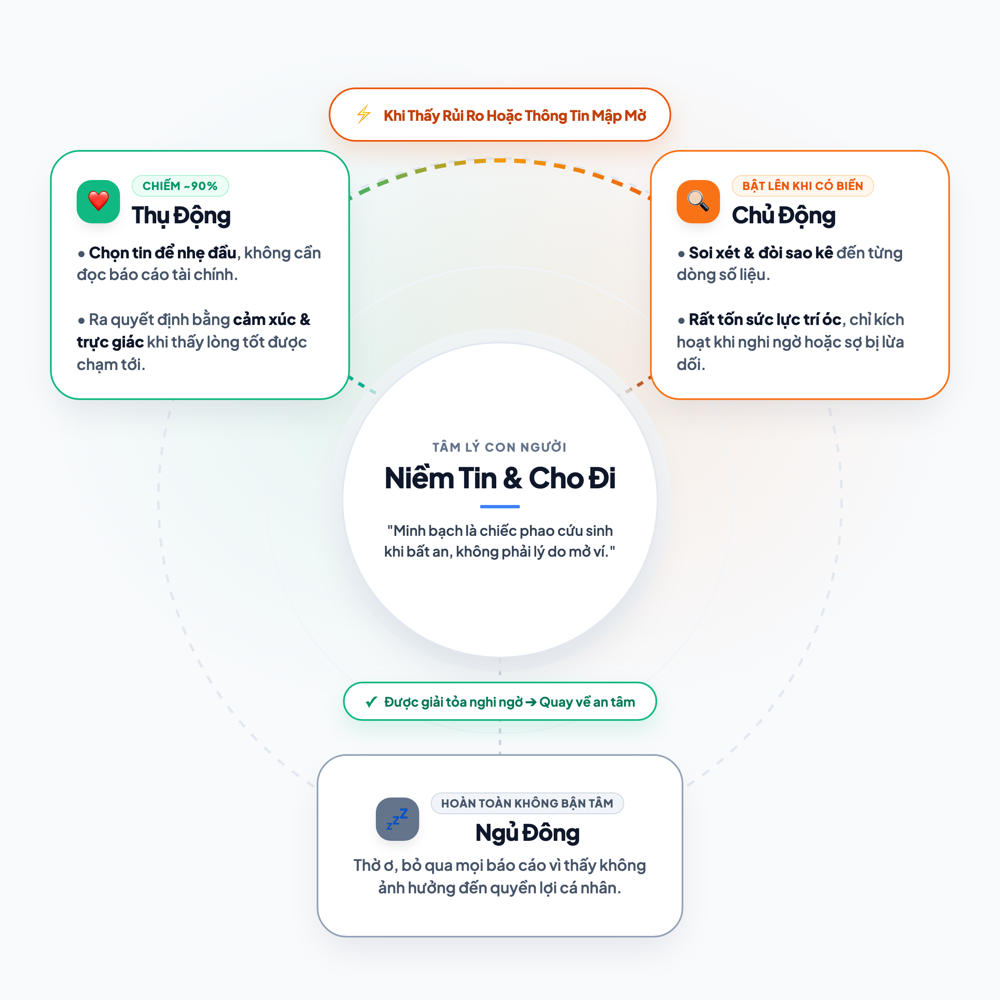

# Làm sao để bán sự minh bạch?

Một buổi chiều cách đây không lâu, tôi ngồi trong một căn phòng họp kính ở trung tâm thành phố. Xung quanh tôi là những kỹ sư phần mềm và những nhà sáng lập công nghệ đang say sưa tranh luận về tương lai của blockchain. Họ vẽ lên bảng những sơ đồ phức tạp: sổ cái phân tán, mã hóa bất biến, những giao dịch ai cũng có thể truy vết tới từng giây, từng xu. Thông điệp cốt lõi của họ rất hùng hồn: *"Khi mọi thứ đều minh bạch 100%, con người sẽ không cần phải tin nhau nữa. Máy móc sẽ bảo đảm sự thật."*

Nhưng khi bước chân ra khỏi tòa nhà đó, hòa vào dòng xe tấp nập lúc tan tầm, tôi lại bắt gặp những hình ảnh rất đỗi quen thuộc ở đời thường: Một người phụ nữ dừng xe bên lề đường, lặng lẽ quét mã chuyển khoản ủng hộ vài trăm nghìn cho một trạm cưu mang chó mèo chỉ sau khi đọc một bài viết xúc động trên mạng xã hội; những đoàn người vào chùa thành tâm gửi chút tiền giọt dầu vào hòm công đức mà chẳng ai bận tâm hỏi xem nhà chùa quản lý số tiền đó ra sao.

Ở hai không gian ấy, dường như đang tồn tại hai thế giới hoàn toàn khác nhau. Một bên tôn sùng "sự minh bạch" như chiếc chìa khóa vạn năng cho tương lai loài người. Một bên, hàng triệu người vẫn đang trao gửi tiền bạc và niềm tin của mình một cách êm đềm, chẳng màng đến những cuốn sổ cái.

Minh bạch từ lâu đã trở thành một món hàng kỳ lạ: Ai đi qua cũng gật gù khen hay, ai cũng bảo nó vô cùng cần thiết, nhưng khi mở ví ra trong đời thực, người ta lại hiếm khi chủ động bỏ tiền chỉ để mua hai chữ "minh bạch". Vì sao lại có nghịch lý như vậy?

---

## 1. Dòng tiền của sự đồng cảm: Giữa triệu đô và bát cơm nghĩa tình

Để tìm câu trả lời, tôi bắt đầu quan sát những nơi mà dòng tiền di chuyển dựa vào niềm tin thuần khiết nhất: từ thiện và tâm linh.

Trong buôn bán thông thường, mối quan hệ trao đổi rất sòng phẳng: bạn trả tiền và bạn cầm mớ rau, chiếc áo hay gói dịch vụ về nhà. Mọi sự minh bạch đều được cân đo ngay trên chất lượng sản phẩm. Nhưng trong từ thiện và tâm linh, thứ bạn nhận về không phải là vật chất, mà là sự thanh thản, niềm hy vọng và cảm giác ấm áp khi thấy lòng tốt của mình được đánh thức.

Thế nhưng, cách dòng tiền đó vận hành lại chia thành hai thái cực rất rõ rệt:

Ở tầng trên là các quỹ từ thiện quốc tế quy mô lớn, từ vài triệu đô trở lên. Trong thế giới của những con số khổng lồ, mọi thứ buộc phải vận hành như một tập đoàn tài chính. Họ thuê các công ty kiểm toán độc lập đắt đỏ về rà soát từng chứng từ, xuất bản những cuốn báo cáo dày cộp hàng trăm trang. Ở quy mô này, sự minh bạch là một thủ tục bắt buộc để giữ tư cách pháp nhân, tuân thủ luật pháp và làm việc với các định chế tài chính toàn cầu. Đó là thứ minh bạch mang tính quy chuẩn, lạnh lùng nhưng cần thiết cho một bộ máy vận hành quy mô lớn.

Thế nhưng, phần lớn những nghĩa cử ta gặp mỗi ngày lại nằm ở tầng dưới: những nhóm thiện nguyện nhỏ lẻ, những bếp cơm tình thương ở bệnh viện, những trạm cứu hộ động vật của các bạn trẻ.

Ở đây, bạn sẽ không tìm thấy bóng dáng của kế toán trưởng hay báo cáo tài chính chuẩn mực. Những người đứng ra làm thường là những người bình dị. Họ vừa đi làm kiếm sống, vừa tranh thủ đêm hôm chạy chữa cho từng ca bệnh ngặt nghèo. Mọi thứ vận hành bằng tấm lòng chân thành và sự gắn kết mộc mạc: một cuốn sổ tay ghi chép vội, vài bức ảnh chụp hóa đơn tiền thuốc thú y hơi nhòe, kèm theo lời cảm ơn chân tình gửi tới cộng đồng.

Ấy vậy mà dòng tiền sẻ chia vẫn bền bỉ chảy về. Người ta vẫn sẵn lòng tin tưởng và gửi gắm những đồng tiền mồ hôi nước mắt của mình vào những nơi chẳng có con dấu kiểm toán nào. Điều gì đã giữ cho sợi dây liên kết ấy bền chặt đến thế?

---

## 2. Nhiều tuần ở trạm cứu hộ chó mèo: Điều gì thực sự mở rộng trái tim?

Để hiểu tận cùng tâm lý ấy, tôi đã dành nhiều tuần trò chuyện với cả những người điều hành trạm cứu hộ thú cưng lẫn những người đều đặn chuyển khoản ủng hộ từ 500 nghìn đến cả triệu đồng mỗi tháng.

Tôi muốn biết: Vào cái giây phút quyết định bấm nút chuyển tiền, điều gì thực sự diễn ra trong đầu họ? Có ai trong số họ từng mở một bảng sao kê ra xem trước khi gửi gắm niềm tin?

Câu trả lời tôi nhận được luôn bắt đầu bằng sự xúc động chân thật.

Một chị nhân viên văn phòng kể với tôi rằng, mỗi lần nhìn thấy bức ảnh một chú mèo bị bỏ rơi bên vệ đường được các bạn tình nguyện viên thức trắng đêm băng bó, tim chị lại thắt lại. Khi chị chuyển một phần tiền lương của mình vào tài khoản của trạm, điều duy nhất chị nghĩ đến là ánh mắt của con vật nhỏ bé ấy: *"Mình chỉ mong bé có đủ tiền thuốc men để vượt qua cơn đau. Giúp được một sinh linh tìm lại sự sống, tự nhiên thấy lòng mình nhẹ nhõm hẳn, thấy một ngày trôi qua có thêm chút ý nghĩa."*

Hóa ra, khi người ta cho đi, động lực lớn nhất và nguyên sơ nhất chính là **lòng trắc ẩn được đánh thức**. Họ muốn thấy mình vừa làm được một điều tử tế giữa cuộc đời bộn bề. Đó là một trạng thái tinh thần rất đẹp đẽ và lành lặn. Tại thời điểm ấy, niềm tin được trao đi trọn vẹn và tự nhiên như hơi thở. Chẳng ai có tâm trí đâu để vừa nhìn một chú cún đang hấp hối lại vừa đi đòi hỏi một bản cân đối kế toán.

Vậy thì hai chữ "minh bạch" xuất hiện khi nào?

Qua những cuộc trò chuyện, tôi nhận ra một quy luật rất thú vị: **Không ai bước vào một mối quan hệ giúp đỡ với tâm thế nghi ngờ hay săm soi sổ sách ngay từ đầu.**

Câu hỏi về "sao kê", "hóa đơn", "minh bạch" chỉ giật mình xuất hiện khi có một sự cố xảy ra. Đó là khi công việc cứu trợ mở rộng quá nhanh khiến thông tin cập nhật bị gián đoạn; đó là khi xuất hiện những lời đồn thổi thất thiệt trên mạng xã hội; hoặc khi cách trả lời của người tiếp nhận bỗng trở nên ngập ngừng, lúng túng.

Ngay tại khoảnh khắc ấy, sự bất an bắt đầu nhen nhóm. Người ủng hộ giật mình tự hỏi: *"Liệu lòng tốt của mình có đang đặt nhầm chỗ? Liệu các bé có thực sự được nhận tiền chữa trị hay không?"*

Chính nỗi sợ bị phụ lòng ấy mới là thứ kéo hai chữ "minh bạch" ra ánh sáng. Nhu cầu minh bạch, xét cho cùng, không phải là lý do khiến người ta mở rộng tấm lòng; nó là **phản xạ tự nhiên để bảo vệ niềm tin**. Khi người ta đòi hỏi sự rõ ràng, đó không phải vì họ ghét bỏ hay muốn làm khó nhau, mà là vì họ muốn tìm một chỗ dựa vững chắc để xua tan âu lo, để có thể tiếp tục an tâm đồng hành cùng những người bạn mà mình từng yêu quý.

---

## 3. Khoa học nói gì: Nghịch lý giữa "đòi hỏi" và "hành động"

Những điều tôi quan sát được ở các trạm cứu hộ chó mèo hóa ra không phải là chuyện cá biệt hay cảm tính. Nó phản ánh một quy luật tâm lý sâu sắc mà khoa học hành vi hiện đại vừa chứng minh bằng những con số rất thuyết phục.

Trong một nghiên cứu quy mô xuất bản vào đầu năm 2025 trên tạp chí khoa học uy tín *Journal of Business Research* (Q1) mang tên *“Consumers demand transparency… but do they actually engage? Exploring motives and interactions with brand transparency information”*, nhóm tác giả Kate Sansome, Jodie Conduit và Dean Wilkie từ Đại học Adelaide (Úc) đã chỉ ra một khoảng cách rất lớn giữa những gì con người nói và cách họ thực sự hành xử trước sự minh bạch.

Nghiên cứu dẫn lại một số liệu nổi tiếng từ báo cáo của NielsenIQ (2022): **Có tới 75% người tiêu dùng tuyên bố rằng minh bạch là yếu tố quan trọng hàng đầu**, và hai phần ba khẳng định họ sẵn sàng từ bỏ một thương hiệu quen thuộc để chuyển sang một bên minh bạch hơn.

Nghe qua những con số ấy, bất kỳ ai làm công nghệ hay kinh doanh cũng sẽ reo lên: Thị trường đang khát khao sự minh bạch biết bao!

Thế nhưng, khi đi sâu vào quan sát thực tế hành vi, các nhà nghiên cứu phát hiện ra một sự thật hoàn toàn trái ngược: **Phần lớn thời gian, người tiêu dùng hầu như không hề chủ động tương tác hay đào sâu vào những thông tin minh bạch được cung cấp.**

Nhóm tác giả phân loại cách con người tiếp nhận thông tin minh bạch thành ba trạng thái:

1. **Xử lý thụ động (Passive processing):** Đây là trạng thái chiếm đa số tuyệt đối trong đời sống thường nhật. Con người vốn dĩ có giới hạn về thời gian và sức lực trí óc. Để giảm bớt gánh nặng đầu óc, chúng ta thường dùng các đường tắt trực giác và cảm xúc. Nếu thấy người đại diện có gương mặt hiền lành, nếu thấy bạn bè mình cũng tin tưởng, nếu thấy những hình ảnh cứu hộ chân thực, ta sẽ tự động mặc định rằng nơi đó đáng tin và chọn trao niềm tin ngay lập tức.
2. **Ngủ đông (Dormant processing):** Trạng thái hoàn toàn thờ ơ, không để tâm vì cảm thấy việc đó không ảnh hưởng gì tới đời sống của mình.
3. **Xử lý chủ động (Active processing):** Ngồi đọc từng trang báo cáo, đối chiếu từng dòng số liệu, truy vấn từng nguồn gốc xuất xứ.

Điều quan trọng nhất mà nghiên cứu của Adelaide Business School chỉ ra là: **Trạng thái "xử lý chủ động" rất hiếm khi tự nhiên diễn ra.** Con người chỉ bất thình lình chuyển từ sự tin tưởng nhẹ nhàng (thụ động) sang soi xét cặn kẽ (chủ động) dưới đúng hai điều kiện kích hoạt:

* **Cảm nhận thấy Rủi ro (Risk in Decision Making):** Khi người ta cảm thấy có nguy cơ mất mát về tài chính, hoặc sợ tổn thương về mặt cảm xúc khi lòng tốt của mình bị đem ra làm trò đùa.
* **Thông tin mập mờ, bất nhất (Incongruity of Information & Vague Language):** Khi những gì nhìn thấy ngoài đời không ăn khớp với lời nói, tạo ra cảm giác có điều gì đó đang bị che giấu.

Như nhóm nghiên cứu đã đúc kết một câu rất đắt giá:  
> *"Consumers may assume a brand is transparent to reduce mental load, but incongruent information prompts active processing."*  
> *(Người ta thường chọn cách tin rằng một tổ chức là minh bạch để đầu óc được nhẹ nhõm; chỉ khi thông tin có sự bất thường, họ mới buộc phải chuyển sang thế chủ động kiểm tra).*

Nhìn lại những kỹ sư blockchain trong căn phòng kính nọ, ta bỗng thấy rõ sai lầm lớn nhất của giới công nghệ: Họ cứ ngỡ người dùng ai cũng rảnh rỗi và thèm muốn làm những "thám tử nghiệp dư", lúc nào cũng khao khát ngồi đối chiếu sổ cái và chuỗi khối.

Nhưng cuộc đời thực tế không vận hành như vậy. Con người ra ngoài kiếm sống đã đủ mệt mỏi; khi họ tìm đến việc thiện, họ muốn tìm một chỗ để gieo hạt giống yêu thương và tìm kiếm sự bình yên trong tâm hồn. Bắt một người đang muốn trao đi yêu thương phải ngồi đọc những bảng mã hóa nhức đầu, chẳng khác nào mang một bài tập kế toán phức tạp ra thách đố một người đang muốn chìa tay giúp đỡ đồng loại.

---

## 4. Bài toán mở: Định vị thương hiệu cho sự minh bạch như thế nào để đi vào lòng người?

Nếu bản chất của minh bạch vốn dĩ mang tính phòng thủ và chỉ bật lên khi con người cảm thấy bất an, thì liệu chúng ta có thể bán nó như một món hàng độc lập hay không?

Có lẽ là không. Ta không thể bán chiếc áo giáp cho một người đang đi dạo trong công viên đầy nắng ấm. Nhưng nếu chiếc áo giáp ấy có thể biến thành một thứ trang phục nhẹ nhàng, ấm áp và đáng mến, thì câu chuyện sẽ hoàn toàn khác.

Đến đây, bài toán của những người làm công nghệ, những người làm xã hội và những người xây dựng thương hiệu không còn là câu chuyện kỹ thuật nữa. Nó trở thành một câu hỏi lớn về **nghệ thuật định vị thương hiệu**: *Làm sao để khoác lên sự minh bạch một diện mạo có thể đi thẳng vào lòng người một cách tự nhiên và ấm áp nhất?*

Liệu sự minh bạch có thể được định vị theo những cách nào?

### Góc nhìn thứ nhất: Minh bạch như một "chuẩn mực cao cấp"

Hãy nghĩ đến những viên kim cương quý giá đi kèm chứng chỉ kiểm định khắt khe của GIA, hay những thương hiệu nông sản hữu cơ dám công khai toàn bộ quy trình chăm bón từ hạt giống đến bàn ăn.

Ở góc nhìn này, sự minh bạch không phải là hành động đi giải trình để chứng minh mình trong sạch. Ngược lại, nó là **lời tuyên ngôn về lòng tự trọng và đẳng cấp cao nhất của sự đàng hoàng**. Tổ chức không đợi ai hỏi mới đưa ra, mà chủ động bày tỏ sự cởi mở như một chuẩn mực sống đẹp: *"Chúng tôi tự tin vào từng việc mình làm đến mức không có gì cần phải giấu giếm."*

Khi được định vị như một phẩm giá cao quý, sự minh bạch mang lại cho người đồng hành cảm giác kiêu hãnh. Người ta ủng hộ hay mua sản phẩm không phải vì nghi ngờ, mà vì họ tự hào được đứng chung hàng ngũ với một tổ chức có chuẩn mực đạo đức vượt trội.

### Góc nhìn thứ hai: Minh bạch như "sự yên tâm vô điều kiện"

Hãy hình dung hệ thống túi khí hay chiếc phao cứu sinh trên một chuyến xe: Lúc bình thường, bạn bước lên xe để trò chuyện cùng bạn bè, để ngắm nhìn phong cảnh tươi đẹp hai bên đường; chẳng ai lên xe để săm soi cái túi khí. Nhưng sự hiện diện thầm lặng của nó đem lại cho bạn một cảm giác an toàn vững chãi để bạn có thể thảnh thơi tận hưởng trọn vẹn chuyến đi.

Nếu sự minh bạch được định vị như một "sự yên tâm vô điều kiện", công nghệ sẽ không bao giờ đứng ra làm phiền người dùng. Phía trước mặt tiền vẫn luôn là câu chuyện của tình người, là hình ảnh những chú cún, chú mèo được chữa lành, là nụ cười của những mảnh đời được nâng đỡ.

Còn công nghệ và sổ sách sẽ lùi sâu về phía sau, đóng vai trò như một người gác cổng thầm lặng. Người cho đi không cần phải nhọc công tính toán, nhưng trong thâm tâm họ luôn có một sự chắc chắn nhẹ nhõm rằng: Đồng tiền của mình đang được bảo bọc an toàn, và nếu có bất kỳ cơn sóng gió nào ập đến, sự thật sáng tỏ đã nằm sẵn ở đó chỉ sau một cái chạm tay.

### Góc nhìn thứ ba: Minh bạch như một "lời hẹn ước tử tế"

Thay vì xuất phát từ sự nghi kỵ lạnh lùng kiểu *"đừng tin ai cả, hãy tự kiểm chứng"*, sự minh bạch hoàn toàn có thể được định vị như một nét đẹp văn hóa của sự tri ân: *"Vì bạn đã trao trọn niềm tin cho chúng tôi, chúng tôi xin gửi lại bạn sự rõ ràng trọn vẹn nhất như một lời cảm ơn sâu sắc."*

Khi ấy, việc công khai tài chính không còn là một nghĩa vụ mệt mỏi hay gánh nặng hành chính. Nó trở thành một nghi thức ấm áp để cả người gây quỹ và người đóng góp cùng ngồi lại bên nhau, nhìn ngắm những thành quả mà họ đã cùng nhau tạo dựng. Minh bạch lúc này là một lời hẹn ước giữa những người bạn tử tế, cùng nhau nuôi dưỡng và gìn giữ ngọn lửa thiện nguyện bền lâu.

---

## 5. Lời kết: Một câu hỏi còn bỏ ngỏ

Rời khỏi những lý thuyết hàn lâm và những dòng code khô khan, ta nhận ra rằng: Bản thân sự minh bạch chưa bao giờ là đích đến cuối cùng của con người.

Nếu chỉ có những cuốn sổ cái bất biến, những thuật toán mã hóa hay những bảng số liệu chi chít, sự minh bạch sẽ mãi mãi là những dòng dữ liệu vô tri. Nó không có nhịp tim, không có hơi ấm, và không thể tự sưởi ấm cho bất kỳ ai.

Sự minh bạch chỉ thực sự có linh hồn khi nó biết nép mình lại để nâng niu sự kết nối giữa người với người.

Có lẽ đã đến lúc những người làm công nghệ và những người xây dựng tương lai cần chậm lại một nhịp, lắng nghe nhịp đập từ đời sống thực tế để tự hỏi mình:

* Liệu công nghệ có thể học cách bớt phô diễn sự logic cứng nhắc để học cách thấu hiểu tính người?
* Và giữa một thế giới đang có quá nhiều sự ngờ vực và âu lo này, sự minh bạch sẽ chọn khoác lên mình chiếc áo nào để bước vào lòng người: **Một món hàng xa xỉ của lòng tự trọng, một chốn nương tựa dịu dàng cho sự an tâm, hay một lời hẹn ước tử tế giữa những trái tim đồng điệu?**

Câu trả lời ấy, có lẽ không nằm trong những dòng mã máy tính, mà nằm ở chính cách chúng ta lựa chọn đối xử với niềm tin của nhau mỗi ngày.
